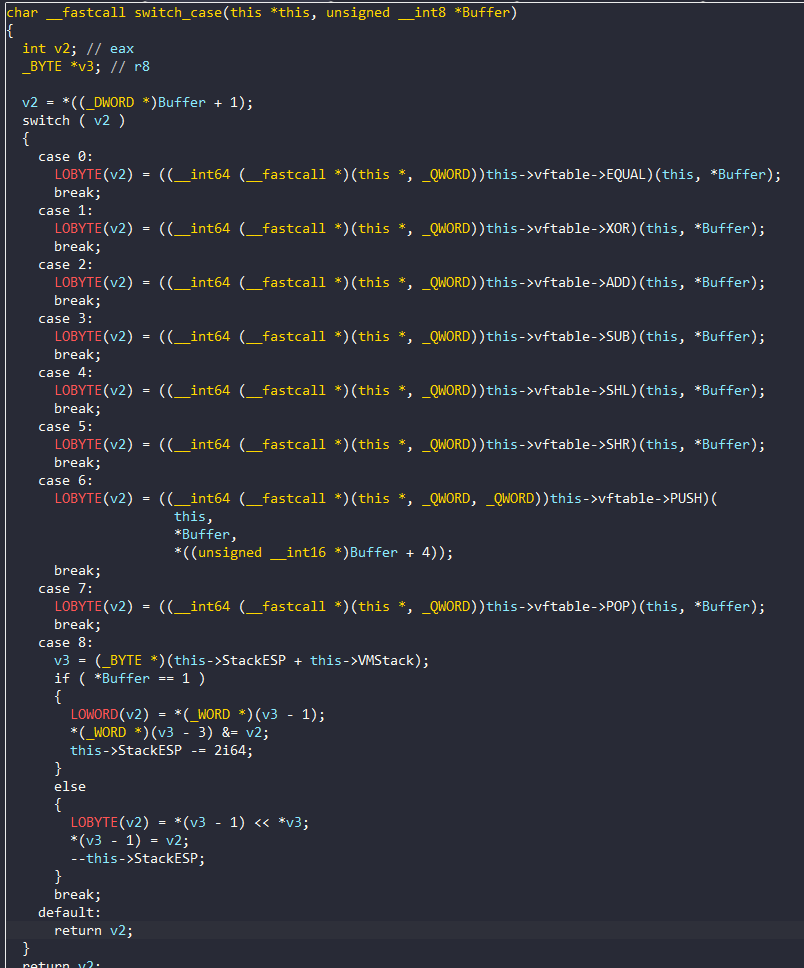

# BabyStack - BKCTF2023

Đây là 1 file PE64, bắt đầu chương trình khởi tạo giá trị sau đó có tạo `vftable`(Virtual Function Table):


Vì chương trình có `vftable` nên nó sẽ trỏ ra rất nhiều địa chỉ hàm nên rất khó đọc. Nên mình sẽ làm một số bước để chương trình dễ đọc hơn

Đầu tiên `Set Ivar Type`-`Y` lại cho `Buffer` và `v32`: 

`char Buffer[8] -> char Buffer[20]` (Vì đây là biến chứa input của chúng ta gồm 20 kí tự)

`int v23[7] ->  char rom[400]` 


Tạo Struct cho `vftable`, vì chưa biết chức năng của các hàm nên mình sẽ rename sau:


Vì bài này sử dụng [StackVM](https://en.wikipedia.org/wiki/Stack_machine), Stack VM là một dạng VM được thiết kế để thao tác các toán tử trên một ngăn xếp (stack) bằng việc đẩy vào (push), lấy ra (pop) và thao tác các toán tử trên stack. Đọc qua thì mình có thể đoán được là  `v18[3]` được dùng để làm con trỏ lên Stack ảo để tính toán, và `v18[4]` là vùng nhớ được tạo để giả lập Stack. 


Vì thế ta sẽ tạo struct cho v18 bằng cách vào **LocalType**(`View`->`Open Subviews`->`Local Type`), `Insert`(Còn 2 phần tử ở giữa mình chưa biết lưu gì nên sẽ để là `data_unknow`):

```C
struct this
{
  struct struc_140003318 *vftable; //struc_140003318 chính là struct vừa tạo cho vftable
  _QWORD data_unknow[2];
  _QWORD StackESP;
  _QWORD VMStack;
};

```

Chuột phải vào v18 sau đó `Convert to struct *` -> chọn struct `this`, đồng thời rename `v18` thành `this`: 


Chương trình chèn `input` của chúng ta vào bytecode ở trên: 


Giả lập Stack tính toán, chương trình sẽ duyệt qua từng opcode:


Chương trình sẽ kiểm tra xem opcode có phải là 6 hay không. Nếu đúng chương trình sẽ trích xuất thêm `rom[count+2]` và `rom[count+3]` ghép lại thành 1 `WORD`, còn lại thì sẽ lấy `BYTE` `rom[count+1]`. Sau đó truyền vào hàm đầu tiên của `vftable`. Chúng ta Convert struct và rename cho tham số của hàm:


Hàm này là một `switch-case`, dựa vào tham số opcode đầu vào để xác định xem sẽ nhảy đến hàm nào của `vftable`. Chúng ta sẽ xem chức năng của các hàm trong `vftable` và rename lại:


Đây là Hàm sau hàm `switch-case` trong stack. Để phân tích các hàm này chúng ta cũng `Convert Struct` cho các tham số. Ta thấy nếu `Buff == 1` thì sẽ lấy 2 `WORD` xò với nhau, ngược lại là 2 `BYTE` tương ứng với check OPCODE bên ngoài. Các hàm còn lại tương tự tương ứng với các lệnh. Chúng ta có thể rename lại trong cửa sổ `Structures`:


Quay trở lại hàm `switch_case` nhần `F5` để load lại:



Sau khi thực hiện xong đoạn opcode trên chương trình check xem StackClear chưa: 


Bây giờ chúng ta sẽ giả lập chương trình, để dump được lệnh của StackVM ra: 

```python
rom = [0x00,0x06,0x00,0x01,0x01,0x06,0x0C,0x0D,0x01,0x06,0x00,0x08,0x01,0x05,0x01,0x06,0x22,0x38,0x01,0x06,0xFF,0x00,0x01,0x08,0x01,0x02,0x01,0x06,0x61,0x61,0x01,0x01,0x01,0x06,0x69,0x4E,0x01,0x00,0x00,0x07,0x00,0x00,0x01,0x06,0x0C,0x0D,0x01,0x06,0x2D,0x41,0x01,0x02,0x01,0x06,0x00,0x08,0x01,0x05,0x01,0x06,0x22,0x38,0x01,0x06,0x55,0x22,0x01,0x01,0x01,0x06,0xFF,0x00,0x01,0x08,0x01,0x02,0x01,0x06,0x61,0x61,0x01,0x01,0x01,0x06,0x32,0x6A,0x01,0x00,0x00,0x07,0x00,0x00,0x01,0x06,0x49,0x30,0x01,0x06,0x00,0x08,0x01,0x05,0x01,0x06,0x3E,0x5E,0x01,0x06,0xFF,0x00,0x01,0x08,0x01,0x02,0x01,0x06,0x61,0x61,0x01,0x01,0x01,0x06,0x45,0x0A,0x01,0x00,0x00,0x07,0x00,0x00,0x01,0x06,0x3B,0x20,0x01,0x06,0x00,0x08,0x01,0x05,0x01,0x06,0x6B,0x2D,0x01,0x06,0xFF,0x00,0x01,0x08,0x01,0x02,0x01,0x06,0x61,0x61,0x01,0x01,0x01,0x06,0x5B,0x78,0x01,0x00,0x00,0x07,0x00,0x00,0x01,0x06,0x2B,0x79,0x01,0x06,0x00,0x08,0x01,0x05,0x01,0x06,0x70,0x41,0x01,0x06,0xFF,0x00,0x01,0x08,0x01,0x02,0x01,0x06,0x61,0x61,0x01,0x01,0x01,0x06,0x37,0x45,0x01,0x00,0x00,0x07,0x00,0x00,0x01,0x06,0x78,0x79,0x01,0x06,0x00,0x08,0x01,0x05,0x01,0x06,0x34,0x41,0x01,0x06,0xFF,0x00,0x01,0x08,0x01,0x02,0x01,0x06,0x61,0x61,0x01,0x01,0x01,0x06,0x55,0x0A,0x01,0x00,0x00,0x07,0x00,0x00,0x01,0x06,0x6A,0x36,0x01,0x06,0x00,0x08,0x01,0x05,0x01,0x06,0x2D,0x01,0x01,0x06,0xFF,0x00,0x01,0x08,0x01,0x02,0x01,0x06,0x61,0x61,0x01,0x01,0x01,0x06,0x58,0x1E,0x01,0x00,0x00,0x07,0x00,0x00,0x01,0x06,0x75,0x1B,0x01,0x06,0x00,0x08,0x01,0x05,0x01,0x06,0x3B,0x17,0x01,0x06,0xFF,0x00,0x01,0x08,0x01,0x02,0x01,0x06,0x61,0x61,0x01,0x01,0x01,0x06,0x0F,0x19,0x01,0x00,0x00,0x07,0x00,0x00,0x01,0x06,0x77,0x7C,0x01,0x06,0x00,0x08,0x01,0x05,0x01,0x06,0x45,0x30,0x01,0x06,0xFF,0x00,0x01,0x08,0x01,0x02,0x01,0x06,0x61,0x61,0x01,0x01,0x01,0x06,0x76,0x03,0x01,0x00,0x00,0x07,0x00,0x00,0x01,0x06,0x0F,0x37,0x01,0x06,0x00,0x08,0x01,0x04,0x01,0x06,0x3B,0x23,0x01,0x06,0x00,0xFF,0x01,0x08,0x01,0x02,0x01,0x06,0x61,0x61,0x01,0x01,0x01,0x06,0x4A,0x12,0x01,0x00,0x00,0x07,0x00,0x00]

i = 0

stack = []

while i < len(rom):
    opcodeSize = 0
    word = -1
    byte = -1
    id = hex(i)[2:].ljust(5, ' ')
    print(id, end='')

    if rom[i + 1] == 6:
        opcodeSize = 4
        word = rom[i + 3] + (rom[i + 2] << 8)
        byte = rom[i]
    else:
        opcodeSize = 2
        byte = rom[i]

    match rom[i + 1]:
        case 0:
            print('EQUAL')
        case 1:
            print('XOR')
        case 2:
            print('ADD')
        case 3:
            print('SUB')
        case 4:
            print('SHL')
        case 5:
            print('SHR')
        case 6:
            print(f'PUSH {hex(word)}')
        case 7:
            print('POP')
        case 8:
            print('AND')

        case _:
            print(f'Invalid opcode {hex(rom[i + 1])}')
            break

    i += opcodeSize
```

Input của mình là `aaaaaaaaaaaaaaaaaaaa` nên chương trình sẽ ra: 

```
0    PUSH 0x1
4    PUSH 0xc0d
8    PUSH 0x8
c    SHR
e    PUSH 0x2238
12   PUSH 0xff00
16   AND
18   ADD
1a   PUSH 0x6161
1e   XOR
20   PUSH 0x694e
24   EQUAL
```
Giải thích 1 đoạn, đầu tiên chương trình `PUSH 0xc0d` và `PUSH 0x8` sau đó `SHR` tương đương với `0xc0d>>0x8 = 0xc` sau đó được lưu trên stack. Tiếp theo tương tự `0x2238&0xff00=0x2200`, lúc này trên đỉnh stack là `0xc` và `0x2200` thực hiện phép `ADD` sẽ được `0x2200+0xc=0x220c` trên stack sau đó XOR `PUSH 0x6161`(vì input của mình là aaaaaa...) lên để xor. Sau đó so sánh với `0x694e`. 

Như vậy input của chúng ta sẽ được XOR với data cố định sau đó so sánh với lại cipher. Chúng ta chỉ cần đọc tương tự như trên sẽ lấy được toàn bộ data và cipher. Cuối cùng là xor lại là ra flag: 

## script
```python
data = [0x220c, 0x7739, 0x3e49, 0x6b3b, 0x702b, 0x3478, 0x2d6a, 0x3b75, 0x4577, 0x3723]
cipher = [0x694e, 0x326a, 0x450a, 0x5b78, 0x3745, 0x550a, 0x581e, 0xf19, 0x7603, 0x4a12]
print(''.join((d ^ c).to_bytes(2,"little").decode() for d, c in zip(data, cipher)))
```
## flag

`BKSEC{C0nGratul4t31}`


#### [wu 2 bài nữa trong giải BKCTF](https://hackmd.io/yvMyX-pEQz-ACo6z7Fp4Ow)


