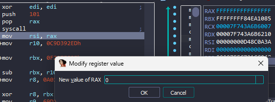

# crackme2

## Overview
Bài cho một file ELF64, chạy thử thì in ra `Wrong flag :(`


Load thử vào IDA64:


Chương trình check tham số đầu vào và độ dài sau đó copy input vào `dest` rồi gọi `sub_4014D2` và hàm này gọi nối tiếp nhau rất nhiều hàm khác:


Mình vào `Strings` tìm xref của `Wrong flag :(` rồi xref của hàm gọi string đó thì được hàm cuối cùng của chuỗi gọi hàm `sub_401356`: 


Hàm `sub_401238` ở đây đang gọi hàm `sys_mmap(0LL, 4096LL, 7LL, 34LL, 0xFFFFFFFFLL, 0LL)`:


Hàm dùng để cấp phát bộ nhớ và quyền của bộ nhớ đấy(gần giống `VirtualAlloc` trong Windows).Các tham số:
* **0LL(NULL)**: Địa chỉ bắt đầu của vùng nhớ được ánh xạ
* **4096LL** : Kích thước vùng nhớ được xạ
* **7LL** : Cờ xác đinh quyền truy cập vào vùng nhớ. 7(111) tương đương với rwx- là đọc, ghi, thực thi.
* **34LL** : Đây là các cờ và các lựa chọn xác định các thuộc tính bổ sung cho vùng ánh xạ. Giá trị 34LL được biểu thị dưới dạng hệ thập phân tương đương với các cờ `MAP_PRIVATE | MAP_ANONYMOUS`. Cờ `MAP_PRIVATE` cho biết rằng vùng ánh xạ chỉ được truy cập bởi quá trình hiện tại và không được chia sẻ với các quá trình khác. Cờ `MAP_ANONYMOUS` cho biết rằng vùng ánh xạ không được liên kết với bất kỳ tệp nào trên hệ thống tệp tin.
* **0xFFFFFFFFLL(-1)**: Đây là địa chỉ kết thúc của vùng ánh xạ, tham số này cho viết hệ thống tự động chọn địa chỉ kết thúc cho vùng ánh xạ.
* **0LL**: Đây là địa chỉ tệp vào trong trường hợp này không được sử dụng vì chúng ta có cờ `MAP_ANONYMOUS`

Như vậy `sys_mmap(0LL, 4096LL, 7LL, 34LL, 0xFFFFFFFFLL, 0LL)` sẽ tạo một vùng ánh xạ mới có kích thước 4096 byte và quyền truy cập cho phép đọc, ghi và thực thi. Như vậy khả năng cao là chương trình sẽ tạo opcode ở đây và thực thi.

Chúng ta tiếp tục:


Nếu cấp phát không thành công, chương trình sẽ gọi hàm `sub_401217()`để in ra `Wrong Flag :(`:


Tiếp tục chương trình sẽ gọi hàm `sub_401318(v0, 908LL)` với tham số là địa chỉ của vùng nhớ được tạo và 908:


Trong này sẽ có một vòng lặp vô tận để gọi hàm `sub_401292()` với 3 tham số là `pointer`địa chỉ vùng nhớ được tạo, `i`, `value` được khởi tạo ban đầu là 908:


Hàm này lấy đầu tiên lấy độ lớn của dữ liệu sẽ viết vào vùng nhớ mà ta khởi tạo ở `dword_40D0A0` với index là `value`, sau đó vào vòng lặp ghi `v5` lần dword vào trong vùng nhớ của chúng ta bằng cách lấy giá trị i `xor` với lại mảng `dword_40D0A0`. Sau khi thực hiện xong chương trình quay lại hàm chính và thực thi đoạn opcode vừa xor đấy:


Đặt thử breakpoint tại đấy và debug chương trình xem nó làm gì. Thì thấy chương trình gồm rất nhiều lệnh `mov`, ấn được 17 lần debug thì chương trình bị thoát ra, xem thử đoạn opcode của lần thứ 16 xem là gì:


Hàm này gọi `syscall` với giá trị `65h` là hàm [`ptrace`](https://chromium.googlesource.com/chromiumos/docs/+/master/constants/syscalls.md) với tham số là edi = 0 - nghĩa là `PTRACE_TRACEME`, như vậy đoạn này tương đương với `ptrace(PTRACE_TRACEME)`, hàm này để checkdebug nếu chúng ta đang debug hàm sẽ trả về -1, ngược lại sẽ trả về 0 hoặc số dương, đấy là lý do tại sao chúng ta lại bị thoát chương trình khi đến lần 17, để bypass hàm này thì chúng ta đặt breakpoint ngay sau dòng gọi `syscall` và sửa `rax` thành giá trị 0:



Sau đó mình ngồi debug tiếp thì tại lần 125 lại bị thoát chương trình, mình lại debug lại từ đầu và xem hàm 124 xem làm gì(Nếu ai lười ấn hoặc sợ ấn sai lại ấn lại nên dùng AutoKeyBoard `F9` =))  ). Ở lần 124 chương trình chỉ check thanh ghi r12 xem có khác không hay không. Để qua được đây ta chỉ cần đặt breakpoint và sửa r12 thành 0:


Ấn `F9` thêm lần nữa, thì ta thấy chương trình gọi hàm `sub_4011F6`:


Hàm `sub4011F6` in ra chuỗi `Correct flag!`:


Tóm lại, chương trình này sẽ khởi tạo 1 vùng nhớ có quyền đọc, ghi, thực thi, sau đó ghi vào vùng nhớ đấy 125 lần và thực thi, chỉ có lần 17 là check debug bằng `ptrace()`, cuối cùng kiểm tra thanh ghi r12 và nếu đúng thì in ra `Correct flag!`, sai thi ngược lại.

## Reverse

Từ những điều trên thì mình đoán rằng `Flag` sẽ được check trong 125 đoạn opcode của chương trình. Vì vậy mình sẽ dump thử 125 đoạn đó ra và xem nó làm gì bằng script:

``` python 
from pwn import *
from unicorn import *
from unicorn.x86_const import *

context.arch = 'amd64'
elf = ELF('./crackme2')

key = 0xad23773b
offset = 0x38c
data = 0x0040d0a0

STOP_ADDRESS = 0

def emulate(sc):
    STACK = 0x2000000
    ADDRESS = 0x1000000
    mu = Uc(UC_ARCH_X86, UC_MODE_64)
    mu.mem_map(ADDRESS, 2 * 1024 * 1024)
    mu.mem_map(STACK, 2 * 1024 * 1024)
    mu.mem_write(ADDRESS, sc)
    mu.reg_write(UC_X86_REG_RSP, STACK+2*1024)
    mu.reg_write(UC_X86_REG_RBP, STACK+2*1024)
    mu.hook_add(UC_HOOK_CODE, hook_code)
    mu.emu_start(ADDRESS, ADDRESS + len(sc))
    eax = mu.reg_read(UC_X86_REG_EAX)
    ecx = mu.reg_read(UC_X86_REG_ECX)
    llen = STOP_ADDRESS-ADDRESS
    return eax, ecx, llen

def hook_code(mu, address, size, user_data):
    global STOP_ADDRESS
    if mu.mem_read(address, size) == b'\xc3':
        STOP_ADDRESS = address
        mu.emu_stop()


full_sc = b''

try:
    while True:
        llen = u32(elf.read(data+offset*4, 4))
        sc = b''
        print(llen)
        for i in range(1,llen+1):
            sc += xor(elf.read(data+offset*4+i*4, 4),p32(key))
        
        print(disasm(sc, offset=data+offset*4+4))

        offset, key, sz = emulate(sc)
        full_sc += sc[:sz]
        print(hex(offset), hex(key))
except Exception as e:
    print(e)
    pass
f = open('sc.bin','wb')
f.write(full_sc)
f.close()
```
Mở file `sc.bin` bằng `Binary Ninja` thì ta được: 


Như vậy nó sẽ check từng khí tự một trong chuỗi flag. Mình đã sắp xếp lại và tìm ra flag:

```plaintext
'g' - zx.q(*(arg1 + 0x4068))
'r' - zx.q(*(arg1 + 0x4069))
'e' - zx.q(*(arg1 + 0x406a))
'y' - zx.q(*(arg1 + 0x406b))
'{' - zx.q(*(arg1 + 0x406c))
'd' - zx.q(*(arg1 + 0x406d))
'1' - zx.q(*(arg1 + 0x406e))
'd' - zx.q(*(arg1 + 0x406f))
'_' - zx.q(*(arg1 + 0x4070))
'y' - zx.q(*(arg1 + 0x4071))
'0' - zx.q(*(arg1 + 0x4072))
'u' - zx.q(*(arg1 + 0x4073))
'_' - zx.q(*(arg1 + 0x4074))
's' - zx.q(*(arg1 + 0x4075))
'0' - zx.q(*(arg1 + 0x4076))
'l' - zx.q(*(arg1 + 0x4077))
'v' - zx.q(*(arg1 + 0x4078))
'3' - zx.q(*(arg1 + 0x4079))
'_' - zx.q(*(arg1 + 0x407a))
'b' - zx.q(*(arg1 + 0x407b))
'y' - zx.q(*(arg1 + 0x407c))
'_' - zx.q(*(arg1 + 0x407d))
'e' - zx.q(*(arg1 + 0x407e))
'm' - zx.q(*(arg1 + 0x407f))
'u' - zx.q(*(arg1 + 0x4080))
'l' - zx.q(*(arg1 + 0x4081))
'4' - zx.q(*(arg1 + 0x4082))
't' - zx.q(*(arg1 + 0x4083))
'1' - zx.q(*(arg1 + 0x4084))
'n' - zx.q(*(arg1 + 0x4085))
'g' - zx.q(*(arg1 + 0x4086))
'?' - zx.q(*(arg1 + 0x4087))
'_' - zx.q(*(arg1 + 0x4088))
'1' - zx.q(*(arg1 + 0x4089))
'e' - zx.q(*(arg1 + 0x408a))
'4' - zx.q(*(arg1 + 0x408b))
'b' - zx.q(*(arg1 + 0x408c))
'8' - zx.q(*(arg1 + 0x408d))
'a' - zx.q(*(arg1 + 0x408e))
'}' - zx.q(*(arg1 + 0x408f))  
```

## flag
`grey{d1d_y0u_s0lv3_by_emul4ting?_1e4b8a}`


