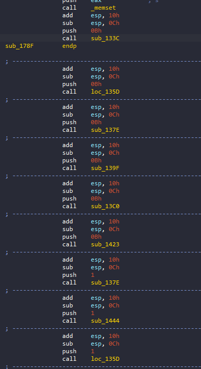

# sigcap
## Overview
Bài cho một file ELF32, khi chạy không in ra gì:


## IDA

Load vào ida32 bắt đầu từ Entry Point:


Hàm main của chúng ta sẽ là `sub_178F`:


Đầu tiên chương trình sử dụng hàm [`signal()`](https://www.tutorialspoint.com/c_standard_library/c_function_signal.htm) với `signal number` ở đây là 4 nghĩa là `SIGINT`(Signal Interrupt), như vậy mỗi khi chương trình xảy ra ngoại lệ thì sẽ gọi hàm `sub_1484`. Hàm `sub_1484`:


Sau khi đọc thì ta biết được hàm này sẽ xét một số giá trị cố định của `unk_4124`, sau đó lấy giá trị trong mảng `byte_4020` với chỉ số mảng là `unk_4124` rồi lưu vào biến `unk_412C`, vì vậy có thể `unk_412C` là flag vì ở đây mảng `byte_4020` là bảng chữ cái:


Quay trở lại hàm `main` chương trình sẽ clear biến `unk_412C` sử dụng `memset` và gọi hàm `sub_133C`:


Hàm này nếu tạo mã giả thì sẽ bị lỗi, có lẽ tác giả đã cố tình gây ra exception ở hàm này. Chuyển qua đọc asm thì ta thấy hàm `main` không chỉ kết thúc ở đấy mà sẽ gọi nhiều hàm ở dưới nữa, vì hàm `sub_133C` có exception nên câu lệnh return không đọc được do đó ida mới hiển thị thiếu. Đây là đoạn sau của hàm `main`:



Mỗi hàm này có nhiệm vụ là lưu 1 giá trị vào `unk_4124` sau đó, có một câu lệnh `ud2`(Undefined Instruction) để tạo ra exception và sẽ gọi hàm `sub1481` để gen ra flag:


Để tìm ra flag thì mình chỉ cần trace hết hàm `main` theo thứ tự đó thì sẽ ra flag. Vì nhiều hàm sẽ gọi đi gọi lại, nên chúng ta có thể đổi tên hàm thành giá trị mà hàm đó đẩy vào `unk_4124`, lấy giá trị đó và mô phỏng lại hàm xử lý exception bằng script:
```python=
key=[0x9,0x2,0x13,0x5,0x1A,0x46,0x13,0x44,0x2,0xA,0x1C,
      0x32,0x46,0x1C,0x30,0x11,0x21,0x44,0x13,0x1C,0x2C,
      0x7,0x21,0x2,0xA,0x1C,0x32,0x13,0x45,0x1B]
arr = b"abcdefghijklmnopqrstuvwxyz{}_-0123456789=/ABCDEFGHIJKLMNOPQRSTUVWXYZ@!$"
for i in range(len(key)):
    print(chr(arr[key[i]]),end="")
```

 Hoặc có thể viết script python trong ida bằng cách đặt breakpoint ở tất cả các dòng `ud2`,trong script sửa `eip` nhảy đến hàm xử lý exception(không thể dùng Appcall vì hàm xử lý exception có rất nhiều tham số mình không thể điền đúng được). Đây là script

```python=
# lấy eip hiện tại( dòng ud2) sau đó push địa chỉ return(eip+2 vì ud2 là 2 byte) lên stack
a = get_reg_value("eip")
set_reg_value(get_reg_value("esp")-4,"esp")
a = a + 2
idaapi.patch_dword(get_reg_value("esp"),a)
#0x5663C484 là địa chỉ đầu tiên của hàm exception
set_reg_value(0x565B9484,"eip")
```
Cách sử dụng: mỗi khi breakpoint chạm đến dòng `ud2` thì chúng ta chạy script cho nhảy vào hàm xử lý exception, sau đó ấn `F9` để chương trình chạm đến breakpoint tiếp theo và lặp lại đến khi hết hàm main(nhớ đặt 1 cái breakpoint cuối hàm main). Cuối cùng chúng ta kiếm tra lại biến `unk_412C` thì lấy được flag:


## flag
`jctf{$t@ck_I$_Gr3@t_Ch3ck_It!}`


