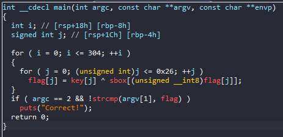

# Tracer

## Overview

Bài cho một file ELF64, nhưng khi chạy không hiện ra gì

## IDA

Thử load vào ida64. Đọc hàm main thì ta thấy được do chương trình cần tham số truyền vào, nếu đúng thì in ra flag, sai thì không in ra gì cả. Và sau đó chương trình sẽ tự tạo ra flag và so sánh với tham số ta truyền vào: 

Vì thế chúng ta chỉ cẩn đặt breakpoint tại dòng so sánh và xem flag:

## flag
`jctf{1m_n3V3r_u51nG_l1bC_@gA1n_76a9f9e}`

