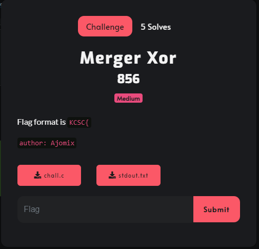

# Merger Xor



---
## overview
Đề bài cho 1 file chall.c:
```c
#include<stdio.h>
#include<string.h>

int 
get_first_4_bit(unsigned char target){
	return target&0xf;
}

int
get_later_4_bit(unsigned char target){
	return (target>>4)&0xf;
}

void
Flat(unsigned char *input,int len){
	unsigned char first_4_bit,later_4_bit,block,cipher[1024];
	for(int idx=0;idx<len;idx++){
		first_4_bit = get_first_4_bit(input[idx]);
		later_4_bit = get_later_4_bit(input[(idx+1)%len]);
		// merging...
		block = (first_4_bit << 4) + later_4_bit;
		cipher[idx] = input[idx]^block;
	}
	memmove(input,cipher,len);
}

int main(){
	unsigned char input[1024],result[1024];
	printf("[+] FLAG: ");
	scanf("%s",input);
	int len = strlen((const char*)input);
	Flat(input,len);
	Flat(input,len);
	Flat(input,len);
	Flat(input,len);
	Flat(input,len);
	printf("[+] Cipher: ");
	for(int i=0;i<len;i++) 
		printf("0x%02x,",input[i]);
	
	return 1;
}
```
Đoạn code trên nếu nhập đúng flag sẽ cho ra file stdout.txt:
```
[+] Cipher: 0x98,0x02,0xaa,0x9b,0xfe,0xdc,0x44,0x73,0xef,0x9d,0x40,0xdd,0xd8,0x05,0xc9,0xea,0x51,0xcd,0xab,0x01,0x77,0x14,0x8c,0x62,0x51,0xea,0x41,0xbe,0xae,0x33,0x23,0xd9,0x9d,0xfe,0x22,0x36,0xdb,0x23,0xfa,0x72,0x36,0xfd,0xb9,0xbc,0x11,0x04,0xfc,0xc8,0xdf
```
Trong bài này flag sẽ được mã hóa 5 lần bằng hàm `Flat()`:
```c 
Flat(unsigned char *input,int len){
	unsigned char first_4_bit,later_4_bit,block,cipher[1024];
	for(int idx=0;idx<len;idx++){
		first_4_bit = get_first_4_bit(input[idx]);
		later_4_bit = get_later_4_bit(input[(idx+1)%len]);
		// merging...
		block = (first_4_bit << 4) + later_4_bit;
		cipher[idx] = input[idx]^block;
	}
	memmove(input,cipher,len);
}
```
Hàm này trích xuất 4 bit cuối cùng của kí tự hiện tại và 4 bit đầu tiên của kí tự tiếp theo sau đó hợp nhất lại với nhau để tạo ra một khối mới rồi XOR khối đó với kí tự hiện tại và lưu trữ kết quả vào chuỗi `cipher[]`.Sau khi hoàn thành thì nó sẽ ghi đè chuỗi ban đầu bằng chuỗi `cipher[]`.Điều này được lặp lại 5 lần, cuối cùng nó in ra kết quả giống trong file stdout.txt.

## reverse
Sau 5 lần mã hóa sẽ tạo ra 5 dãy mã, và bài in dãy mã cuối cùng. Để giải mã ngược lại từng dãy thì ta chỉ cần dãy mã hiện tại và phần tử đầu tiên của dãy mã trước.Nhưng làm sao để tìm được phần tử của dãy mã trước đây? Tia hi vọng duy nhất là từ 5 kí tự đầu của fomart flag `KCSC{`.Lấy 5 kí tự này chạy 5 lần hàm mã hóa `Flat()` thì ta sẽ thu được:
- Lần 0 5 kí tự đúng: 0x4b,0x43,0x53,0x43,0x7b("KCSC{")
- Lần 1 4 kí tự đúng: 0xff,0x76,0x67,0x74,0xc?(đúng 4 bit đầu)
- Lần 2 4 kí tự đúng: 0x08,0x10,0x10,0x38
- Lần 3 3 kí tự đúng: 0x89,0x11,0x13,0xb?(đúng 4 bit đầu)
- Lần 4 3 kí tự đúng: 0x18,0x00,0x28
- Lần 5: 0x98,0x02,0xaa,0x9b,0xfe,0xdc,0x44,0x73,0xef,0x9d,0x40,0xdd,0xd8,0x05,0xc9,0xea,0x51,0xcd,0xab,0x01,0x77,0x14,0x8c,0x62,0x51,0xea,0x41,0xbe,0xae,0x33,0x23,0xd9,0x9d,0xfe,0x22,0x36,0xdb,0x23,0xfa,0x72,0x36,0xfd,0xb9,0xbc,0x11,0x04,0xfc,0xc8,0xdf

Cách giải mã: Ta sẽ giải mã từ Lần 5 dần lên và lấy được flag, ta lấy 4 bit cuối của phần tử hiện tại của dãy mã hiện tại `xor` với 4 bit cuối của phần tử hiện tại của dãy mã trước thì ta được 4 bit đầu của phần tử tiếp theo của mã trước.Sau đó lấy 4 bit đầu của phần tử tiếp theo đó `xor` với 4 bit đầu của phần tử tiếp theo của dãy mã hiện tại, ta sẽ thu được 4 bit cuối của phần tử tiếp theo của dãy mã trước, chạy lần lượt như thế ta sẽ thu được từng dãy mã và cuối cùng là Flag.
## script
```python
a=[0x98,0x02,0xaa,0x9b,0xfe,0xdc,0x44,0x73,0xef,0x9d,0x40,0xdd,0xd8,0x05,0xc9,0xea,0x51,0xcd,0xab,0x01,0x77,0x14,0x8c,0x62,0x51,0xea,0x41,0xbe,0xae,0x33,0x23,0xd9,0x9d,0xfe,0x22,0x36,0xdb,0x23,0xfa,0x72,0x36,0xfd,0xb9,0xbc,0x11,0x04,0xfc,0xc8,0xdf]
b=[0x18]

for i in range(0,len(a),1):
    b.append((((b[i]&0xf)^(a[i%len(a)]&0xf))<<4)+(((b[i]&0xf)^(a[i]&0xf))^(a[(i+1)%len(a)]>>4)))

c=[0x89]
for i in range(0,len(b),1):
    c.append((((c[i]&0xf)^(b[i%len(b)]&0xf))<<4)+(((c[i]&0xf)^(b[i]&0xf))^(b[(i+1)%len(b)]>>4)))

d=[0x08]
for i in range(0,len(c),1):
     d.append((((d[i]&0xf)^(c[i%len(c)]&0xf))<<4)+(((d[i]&0xf)^(c[i]&0xf))^(c[(i+1)%len(c)]>>4)))

e=[0xff]
for i in range(0,len(d),1):
     e.append((((e[i]&0xf)^(d[i%len(d)]&0xf))<<4)+(((e[i]&0xf)^(d[i]&0xf))^(d[(i+1)%len(d)]>>4)))
 
flag=[0x4b]
for i in range(0,len(a),1):
     flag.append((((flag[i]&0xf)^(e[i%len(e)]&0xf))<<4)+(((flag[i]&0xf)^(e[i]&0xf))^(e[(i+1)%len(e)]>>4)))
for i in range(len(flag)-1):
     print(chr(flag[i]),end="")
```
## flag
`KCSC{https://www.youtube.com/watch?v=ueDH4iL7060}`
