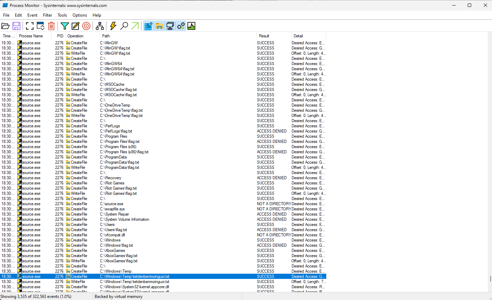

# find me

---
Tải về chạy thử chương trình thì thấy chương trình tạo một file flag.txt trong tất cả các thư mục của ổ C. Nhưng khi mở ra thì....
Như vậy có thể flag sẽ được giấu ở đâu đó trong ổ C vì Find mee in C Diskk mà :v Vì vậy mình sẽ dùng Process Monitor xem chương trình nó làm gì, setup Fillter sẽ gồm 2 Operator là `CreateFile` và `WriteFile`, và chọn tên của chương trình `source.exe` và ta được kết quả:

Ta thấy ngoài tạo rất nhiều file `flag.txt` thì còn tạo 1 file rất đáng nghi `tetdenbenmoinguoi.txt` trong `C:\Windows\Temp`. Mở ra thì lấy được flag
## flag

`KCSC{T3t_n4y_4nh_kh0ng_th3m_d0t_ph4o_V1_ti3ng_cu0i_3m_r0n_r4_l0ng_4nh_r0i!}`