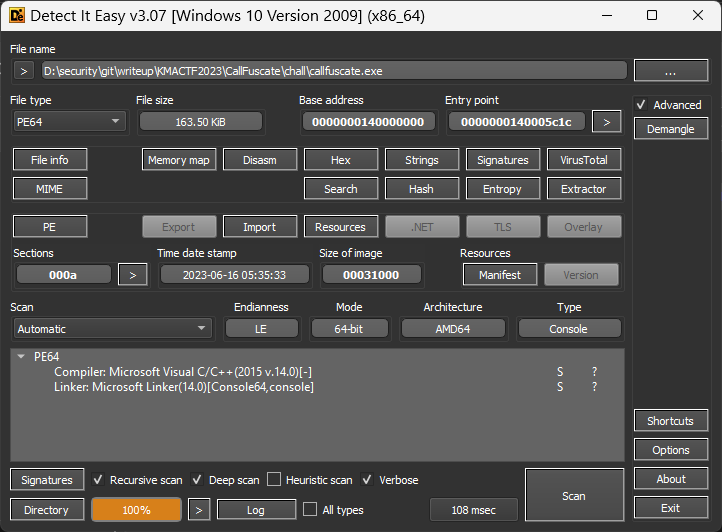
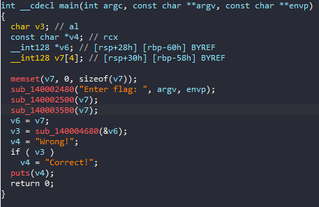
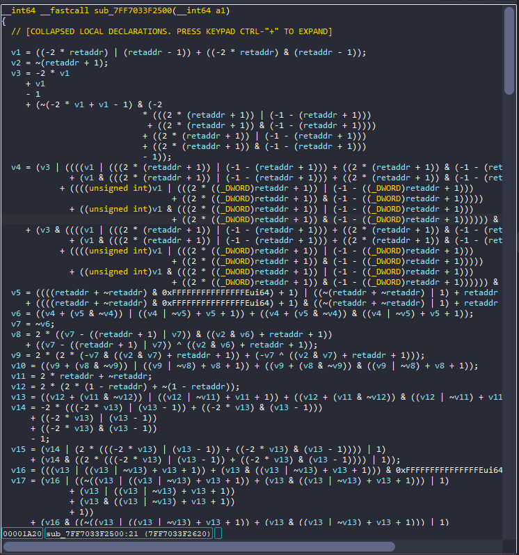
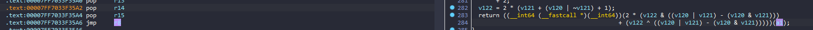
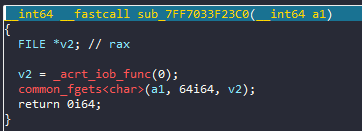
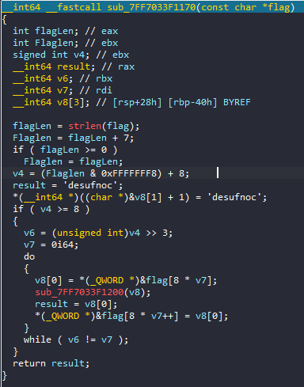
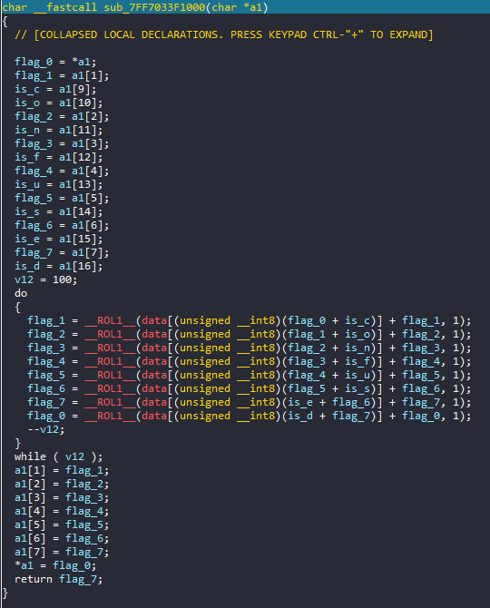
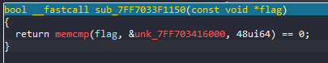

# CallFuscate

## overview

Bài cho một file PE64



## Reverse

Load vào ida64, chúng ta bắt đầu từ hàm `main`:



Chương trình `memset` biến `v7`, sau đó in ra dòng `Enter flag:`, `debug` thử thì biến `v7` chính là input của chúng ta, và gọi rất nhiều hàm sử dụng `v7` làm tham số. Chúng ta sẽ đi vào từng hàm 1, đầu tiên là `sub_140002500`:



Khi ấn vào hàm này mình không bất ngờ vì tên bài là `CallFuscate` mà, chắc chắn là phải rối rồi. Đầu tiên mình ấn vào biến `a1`(input) để xem hàm sẽ sử dụng ở chỗ nào, thì có duy nhất ở đoạn return cuối cùng sẽ gọi một hàm và tham số là input:



Như vậy đoạn tính toán trên chỉ để tính địa chỉ hàm để gọi. Chúng ta đặt `breakpoint` tại dòng `jmp r8`, chạy chương trình và `F7` vào thì ta thấy đây là một hàm `scanf`:



Xem tiếp hàm `sub_1400035B0` cũng tương tự như trên khi `F7` vào ta được:



Hàm này đầu tiên làm tròn độ dài của `flag` -> `v4 = (Flaglen & 0xFFFFFFF8) +8`, rồi khởi tạo biến `result` là string "confused". Sau đó lần lượt gán lần tượt từng 8 kí tự của `flag` và string `confused` vào `v8` và truyền vào hàm `sub_7FF7033F1200`. Hàm `sub_7FF7033F1200` cũng có kiểu gọi tương tự như 2 hàm trên, ta lại đặt breakpoint tại lệnh jump cuối và F7 thì vào được hàm mã hoá, mình rename lại 1 số biến cho dễ hiểu:



Ta có thể thấy hàm này sẽ mã hoá từng 8 kí tự của flag bằng cách sử dụng hàm `ROL` với một mảng data 100 lần. Sau khi hàm này mã hoá xong sẽ quay trở lại hàm main và gọi hàm `sub_140004680`. Cũng đặt breakpoint và F7 thì ta thấy hàm này sẽ check flag của chúng ta bằng cách so sánh flag đã bị mã hoá với một mảng byte:



Và từ hàm này ta biết được flag sẽ có 48 kí tự. 

## script

```python=
flag = [  0xE5, 0xA8, 0x07, 0x2E, 0xE8, 0x67, 0xB5, 0x0C, 0xF9, 0x05, 
0xA1, 0xA8, 0xFA, 0x05, 0x0A, 0x66, 0xA0, 0xC1, 0x20, 0x4E, 
0xE3, 0x7D, 0xD0, 0x04, 0x21, 0x67, 0xEC, 0x9E, 0x7D, 0xBC, 
0x2D, 0x8D,0x9B, 0x65, 0xDC, 0x71, 0xE4, 0x57, 0x81, 0x11, 
0x1A, 0x71, 0x7F, 0x84, 0x2C, 0x88, 0x25, 0x94 ]

data =[0x63, 0x7C, 0x77, 0x7B, 0xF2, 0x6B, 0x6F, 0xC5, 0x30, 0x01, 
  0x67, 0x2B, 0xFE, 0xD7, 0xAB, 0x76, 0xCA, 0x82, 0xC9, 0x7D, 
  0xFA, 0x59, 0x47, 0xF0, 0xAD, 0xD4, 0xA2, 0xAF, 0x9C, 0xA4, 
  0x72, 0xC0, 0xB7, 0xFD, 0x93, 0x26, 0x36, 0x3F, 0xF7, 0xCC, 
  0x34, 0xA5, 0xE5, 0xF1, 0x71, 0xD8, 0x31, 0x15, 0x04, 0xC7, 
  0x23, 0xC3, 0x18, 0x96, 0x05, 0x9A, 0x07, 0x12, 0x80, 0xE2, 
  0xEB, 0x27, 0xB2, 0x75, 0x09, 0x83, 0x2C, 0x1A, 0x1B, 0x6E, 
  0x5A, 0xA0, 0x52, 0x3B, 0xD6, 0xB3, 0x29, 0xE3, 0x2F, 0x84, 
  0x53, 0xD1, 0x00, 0xED, 0x20, 0xFC, 0xB1, 0x5B, 0x6A, 0xCB, 
  0xBE, 0x39, 0x4A, 0x4C, 0x58, 0xCF, 0xD0, 0xEF, 0xAA, 0xFB, 
  0x43, 0x4D, 0x33, 0x85, 0x45, 0xF9, 0x02, 0x7F, 0x50, 0x3C, 
  0x9F, 0xA8, 0x51, 0xA3, 0x40, 0x8F, 0x92, 0x9D, 0x38, 0xF5, 
  0xBC, 0xB6, 0xDA, 0x21, 0x10, 0xFF, 0xF3, 0xD2, 0xCD, 0x0C, 
  0x13, 0xEC, 0x5F, 0x97, 0x44, 0x17, 0xC4, 0xA7, 0x7E, 0x3D, 
  0x64, 0x5D, 0x19, 0x73, 0x60, 0x81, 0x4F, 0xDC, 0x22, 0x2A, 
  0x90, 0x88, 0x46, 0xEE, 0xB8, 0x14, 0xDE, 0x5E, 0x0B, 0xDB, 
  0xE0, 0x32, 0x3A, 0x0A, 0x49, 0x06, 0x24, 0x5C, 0xC2, 0xD3, 
  0xAC, 0x62, 0x91, 0x95, 0xE4, 0x79, 0xE7, 0xC8, 0x37, 0x6D, 
  0x8D, 0xD5, 0x4E, 0xA9, 0x6C, 0x56, 0xF4, 0xEA, 0x65, 0x7A, 
  0xAE, 0x08, 0xBA, 0x78, 0x25, 0x2E, 0x1C, 0xA6, 0xB4, 0xC6, 
  0xE8, 0xDD, 0x74, 0x1F, 0x4B, 0xBD, 0x8B, 0x8A, 0x70, 0x3E, 
  0xB5, 0x66, 0x48, 0x03, 0xF6, 0x0E, 0x61, 0x35, 0x57, 0xB9, 
  0x86, 0xC1, 0x1D, 0x9E, 0xE1, 0xF8, 0x98, 0x11, 0x69, 0xD9, 
  0x8E, 0x94, 0x9B, 0x1E, 0x87, 0xE9, 0xCE, 0x55, 0x28, 0xDF, 
  0x8C, 0xA1, 0x89, 0x0D, 0xBF, 0xE6, 0x42, 0x68, 0x41, 0x99, 
  0x2D, 0x0F, 0xB0, 0x54, 0xBB, 0x16]

ror = lambda val, r_bits, max_bits: \
    ((val & (2**max_bits-1)) >> r_bits%max_bits) | \
    (val << (max_bits-(r_bits%max_bits)) & (2**max_bits-1))

for i in range(6):
    
        for j in range(100):
            flag[i*8+0]=0xff&((ror((flag[i*8+0])&0xff,1,8))-data[(flag[i*8+7]&0xff)+ord("d")&0xff])
            flag[i*8+7]=0xff&((ror((flag[i*8+7])&0xff,1,8))-data[(flag[i*8+6]&0xff)+ord("e")&0xff])
            flag[i*8+6]=0xff&((ror((flag[i*8+6])&0xff,1,8))-data[(flag[i*8+5]&0xff)+ord("s")&0xff])
            flag[i*8+5]=0xff&((ror((flag[i*8+5])&0xff,1,8))-data[(flag[i*8+4]&0xff)+ord("u")&0xff])
            flag[i*8+4]=0xff&((ror((flag[i*8+4])&0xff,1,8))-data[(flag[i*8+3]&0xff)+ord("f")&0xff])
            flag[i*8+3]=0xff&((ror((flag[i*8+3])&0xff,1,8))-data[(flag[i*8+2]&0xff)+ord("n")&0xff])
            flag[i*8+2]=0xff&((ror((flag[i*8+2])&0xff,1,8))-data[(flag[i*8+1]&0xff)+ord("o")&0xff])
            flag[i*8+1]=0xff&((ror((flag[i*8+1])&0xff,1,8))-data[(flag[i*8+0]&0xff)+ord("c")&0xff])

for i in range(len(flag)):
    print(chr(flag[i]),end="")
```
## flag

`KMA{e81eabf0-db79-463d-b227-ea47dcf6cac6}`

