# Gozarus

## Overview 

Bài cho một file PE64 được code bằng Go 

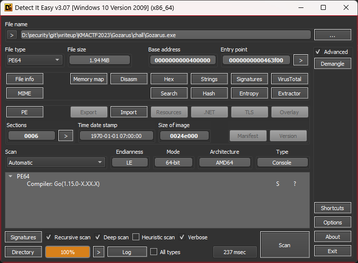

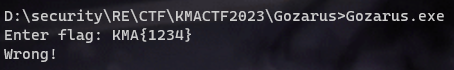

## Reverse 

### IDA 

Load vào ida thì thấy file đã bị strip hết symbol nên mình dùng tool [GoReSym](https://github.com/mandiant/GoReSym) để rename lại. 

Đầu tiên mình tìm hàm `main` trong cửa sổ Function:

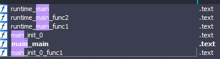

Bắt đầu từ hàm `main`, trong hàm ta thấy chương trình sử dụng hàm `DialPipe`-là một hàm trong thư viện [`win-io`](https://github.com/microsoft/go-winio/blob/main/pipe.go) của Go để kết nối tới pipe `\\.\\pipe\\KMACEETCE`:

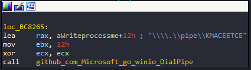

Nói qua về `Pipe`, trong hệ điều hành Windows, pipe (ống nối) được sử dụng để truyền dữ liệu giữa các tiến trình. Một pipe cho phép một tiến trình ghi dữ liệu vào nó và tiến trình khác đọc dữ liệu từ nó. Điều này cho phép truyền thông tin hoặc kết nối giữa các tiến trình độc lập.

Có hai loại pipe trong Windows: named pipe (ống có tên) và anonymous pipe (ống vô danh). Named pipe cho phép giao tiếp giữa các tiến trình không liên quan, trong khi anonymous pipe chỉ hoạt động trong cùng một tiến trình hoặc tiến trình con.

* **CreatePipe**: Tạo một anonymous pipe và trả về hai handle, một handle cho đọc và một handle cho ghi. API này được sử dụng để tạo một anonymous pipe giữa hai tiến trình.

* **CreateNamedPipe**: Tạo một named pipe và trả về một handle cho named pipe đã tạo. API này được sử dụng để tạo một named pipe cho giao tiếp giữa các tiến trình không liên quan.

* **ConnectNamedPipe**: Cho phép một tiến trình khác kết nối đến named pipe đã được tạo. API này được sử dụng sau khi tiến trình đã tạo named pipe sử dụng CreateNamedPipe.

* **ReadFile/WriteFile**: Đọc dữ liệu từ pipe hoặc ghi dữ liệu vào pipe. Hai API này được sử dụng để truyền dữ liệu qua pipe giữa các tiến trình.

Quay trở lại bài, ta thấy phần còn lại của hàm `main` chỉ đã đọc ghi dữ liệu. Chúng ta chuyển qua main `main_init_0_func1` hàm này sẽ là hàm khởi tạo, sẽ chạy trước hàm main của chúng ta:

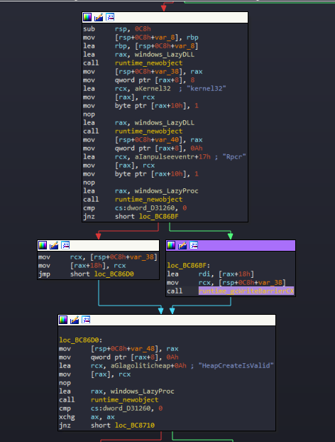

Ta thấy chương trình import thư viện `Kernel32` sau đó tạo một số object API như là `Rpcr` , `HeapValidate`, `HeapAlloc`, `EnumSystemLocalesA`, `UuidFromStringA` và sử dụng `LazyProc_Call` để gọi những API này. Dựa vào đống API trên thì đây là thủ thuật `Shellcode Execution via EnumSystemLocalA` được sử dụng trong mã độc lợi dụng `UuidFromStringA` để tạo shellcode thay vì `memcpy` hoặc `WriteProcessMemory`, và `EnumSystemLocalesA` để thực thi shellcode thay vì `CreateThread`, để hiểu thêm thì các bạn có thể tham khảo những bài viết [này](https://research.nccgroup.com/2021/01/23/rift-analysing-a-lazarus-shellcode-execution-method/), [này](https://research.nccgroup.com/2021/01/23/rift-analysing-a-lazarus-shellcode-execution-method/), và [này](https://github.com/Bl4ckM1rror/FUD-UUID-Shellcode)


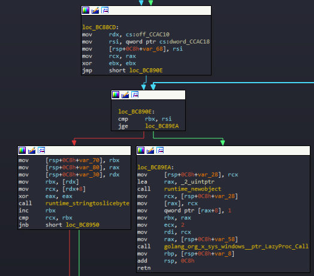

Sau khi đọc qua ta biết được `UUID` sẽ được lưu tại `off_CCAC`, sau đó sẽ sử dụng hàm `UuidFromStringA` để ghi từng `UUID` vào bộ nhớ `0xA60` lần:

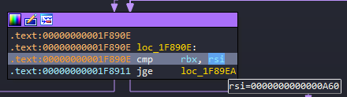

Sau đó sẽ gọi API được lưu `var_58` là `EnumSystemLocalesA`:

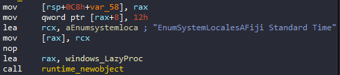

Chương trình sẽ sử dụng LazyProc_Call gọi API `EnumSystemLocalesA` để thực thi ShellCode vừa được ghi vào bộ nhớ. 

Vì vậy mình sẽ đặt breakpoint ngay sau khi chương trình thực hiện ghi xong `0xA60` lần vào bộ nhớ:

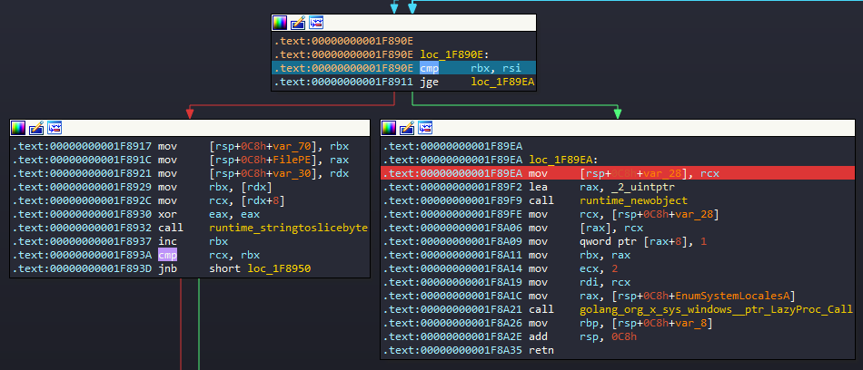

Đoạn shellcode đã được ghi vào địa chỉ ở trong `var_28`:

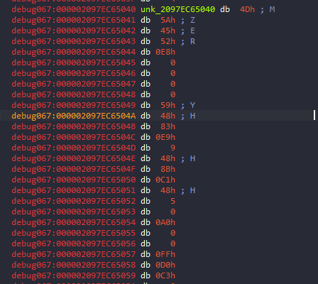

Nhìn qua chúng ta có thể thấy đây là 1 file PE. Mình sẽ dùng script python để dump file PE này ra:

```python=
# 1 uuid có độ dài 128 bit đổi sang sẽ là 128/8 = 16 byte và nhân với 0xA60 lần
len = 0xA60*(128/8)
addr = 0x000002097EC65040
bin= idc.get_bytes(addr,int(len))
open(r"bin.exe","wb").write(bin)
```

Chúng ta cho file `bin.exe` vừa dump được vào ida64, bắt đầu từ hàm main:

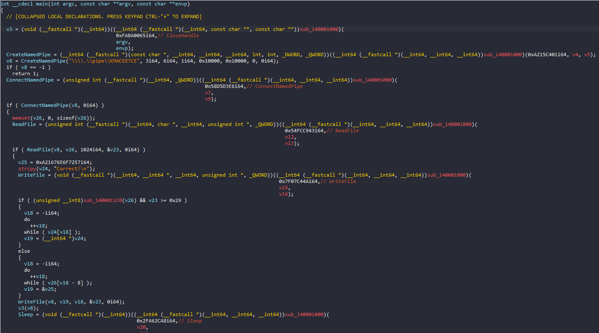

Đây là hàm main của chương trình, hàm `sub_140001000` sử dụng mã hash để resolve API từ PEB, mình đã tra tên các hàm bằng mã hash ở [đây](https://github.com/tildedennis/malware/blob/master/neutrino_bot_5.1/api_hashes) và rename lại cá hàm. Chúng ta có thể thấy trong này chương trình đã `CreateNamedPipe` và kết nối ra bên ngoài chương trình vừa nãy bằng `ConnectNamedPipe`. Sau đó sử dụng `ReadFile` để nhận input từ hàm main của chương trình cha. Sau đó input được truyền vào hàm `sub_140011C0`:

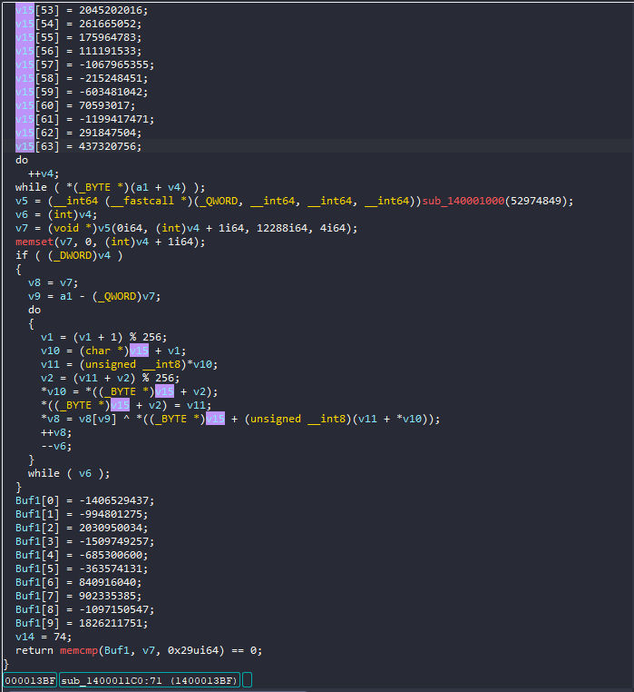

Hàm này mã hoá flag của chúng ta bằng thuật toán RC4 sau đó so sánh với `Buf1`, vì RC4 là thuật toán mã hoá đối xứng, vì vậy chỉ cần cho đầu vào của hàm này là `Buf1` thì output sẽ là flag của chúng ta:

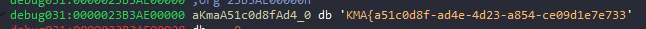

## flag

KMA{a51c0d8f-ad4e-4d23-a854-ce09d1e7e733}