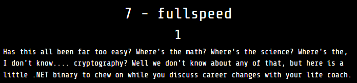

We have a 64-bit C/C++ program:

  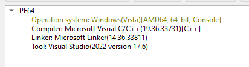

However, note the following two signs of the file:

  - There's only one export `DotNetRuntimeDebugHeader`:

    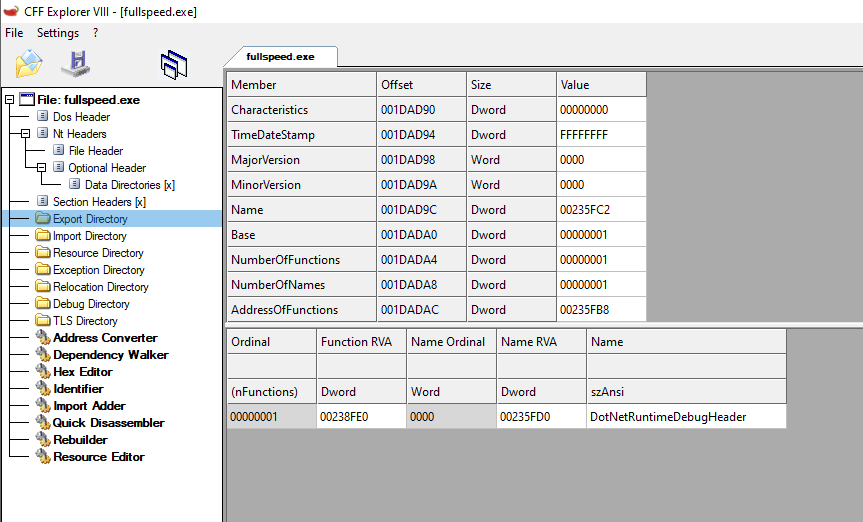

  - It contains these sections `.managed`, `.hydrated`:

    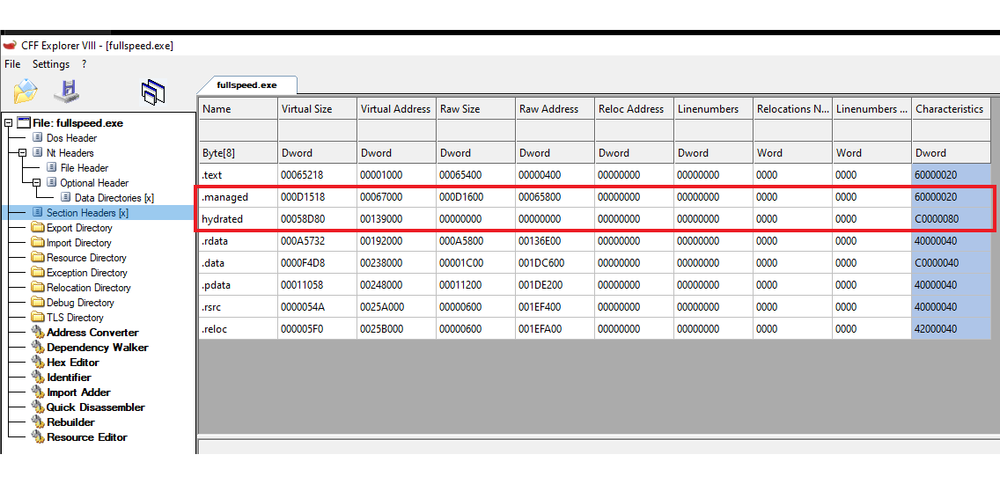

This tells us that it is a .NET program using [AOT](https://learn.microsoft.com/en-us/dotnet/core/deploying/native-aot/?tabs=windows%2Cnet8) (Ahead of Time) compilation.

IDA doesn’t have signatures for .NET runtime functions compiled AOT, so nothing is recognized. Therefore, we need to rebuild the symbols for it. Based on the libraries used by the binary as shown in IDA String, I recreated sig in C# using the [Bouncy Castle](https://github.com/bcgit/bc-csharp) library following this [post](https://harfanglab.io/insidethelab/reverse-engineering-ida-pro-aot-net). Placing sig file in the `/sig/pc` folder of IDA, now loading the binary, we can easily read it.

After debugging, I was able to summarize what this program does:

This function resolves strings:

  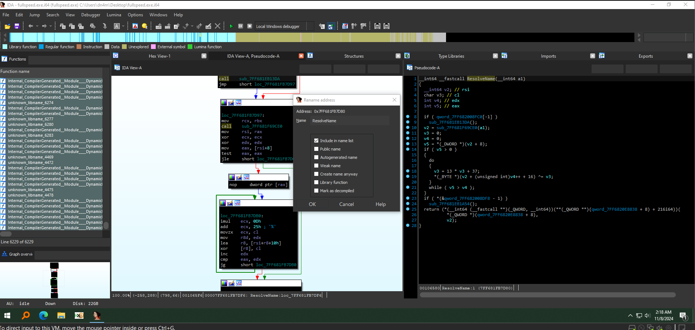

I obtained the strings resolved at the calls to this function using the following IDA script:

```
  param = get_operand_value(prev_head(i, 0), 1)
  addr = Appcall.ResolveName(param).value + 12
  result = ida_bytes.get_strlit_contents(addr, -1, ida_nalt.STRTYPE_C_16)
  set_cmt(i, result.decode(), 0)
```

  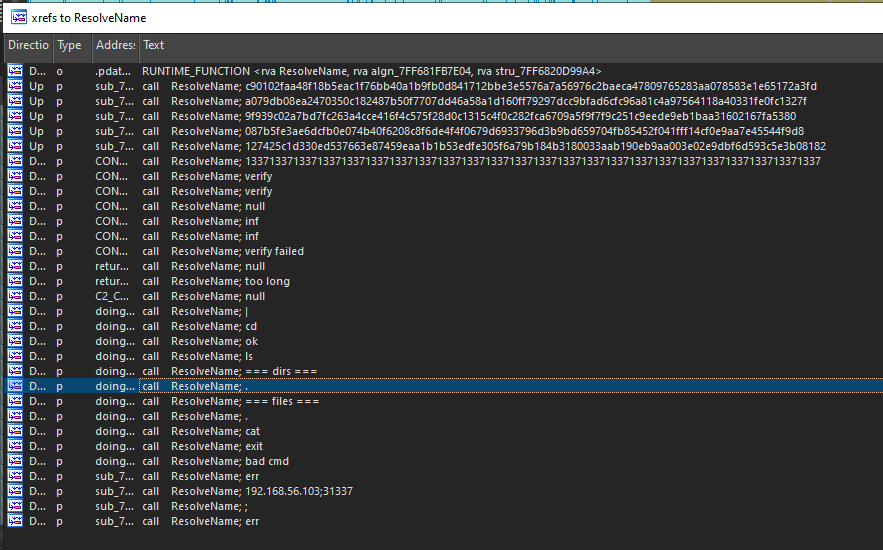

With a pcap file, understanding what we need to do is to analyze the traffic. I debugged with [FakeNet](https://github.com/mandiant/flare-fakenet-ng) until I receive connection to trace to the socket working parts, and so on.

Function at address `0x7FF681FB7EA0`, which carries out the main functions, and the necessary information for solving the challenge. But first, let's take a look at the `sub_7FF67A187BC0`, which i find by Xref one of the resolved strings:

  - Create Curve:
    
  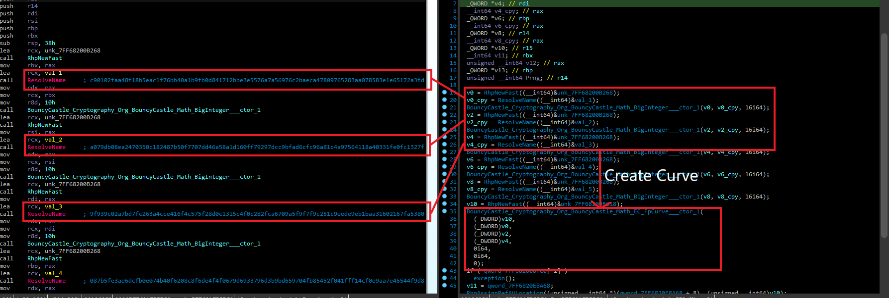

  - Create Curve point G:

  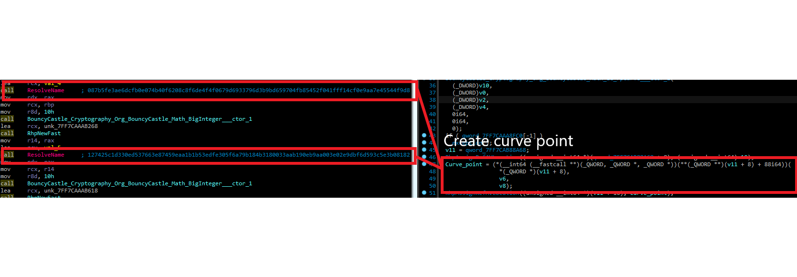 

  - Generate a random number using PRNG (let’s call it N).

  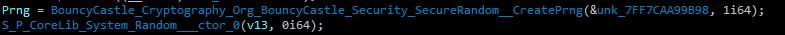 

From G and N, we can derive the public key. However, we currently don’t have N. Based on this [writeup](https://github.com/hgarrereyn/Th3g3ntl3man-CTF-Writeups/blob/master/2017/picoCTF_2017/problems/cryptography/ECC2/ECC2.md), i was able to retrieve N using the following Python script:

  ```
from sage.all import *

def dis_log(G, Q, factors):
    logs = []
    mod = []
    for factor in factors:
        G_factor = (G.order() // factor) * G
        Q_factor = (G.order() // factor) * Q
        log_factor = discrete_log(Q_factor, G_factor, operation='+')
        logs.append(log_factor)
        mod.append(factor)
    return logs, mod

def check_key(candidate_key, G, Q):
    return G * candidate_key == Q

p = 0xc90102faa48f18b5eac1f76bb40a1b9fb0d841712bbe3e5576a7a56976c2baeca47809765283aa078583e1e65172a3fd
a = 0xa079db08ea2470350c182487b50f7707dd46a58a1d160ff79297dcc9bfad6cfc96a81c4a97564118a40331fe0fc1327f
b = 0x9f939c02a7bd7fc263a4cce416f4c575f28d0c1315c4f0c282fca6709a5f9f7f9c251c9eede9eb1baa31602167fa5380
Gx = 0x087b5fe3ae6dcfb0e074b40f6208c8f6de4f4f0679d6933796d3b9bd659704fb85452f041fff14cf0e9aa7e45544f9d8
Gy = 0x127425c1d330ed537663e87459eaa1b1b53edfe305f6a79b184b3180033aab190eb9aa003e02e9dbf6d593c5e3b08182
Qx = 0x195B46A760ED5A425DADCAB37945867056D3E1A50124FFFAB78651193CEA7758D4D590BED4F5F62D4A291270F1DCF499 #xored 0x1337
Qy = 0x357731EDEBF0745D081033A668B58AAA51FA0B4FC02CD64C7E8668A016F0EC1317FCAC24D8EC9F3E75167077561E2A15 #xored 0x1337

E = EllipticCurve(GF(p), [a, b])
G = E(Gx, Gy)
Q = E(Qx, Qy)
o_G = G.order()
factors = factor(o_G)
filf = [factor for factor, _ in factors if factor.nbits() <= 60]
logs, mod = dis_log(G, Q, filf)
u = crt(logs, mod)
prime = prod(filf)
upper_bound_m = int(1 + 2**128 / prime)


for m in range(upper_bound_m):
    mtkey = u + m * prime
    if check_key(mtkey, G, Q):
        print(hex(mtkey))
        break  

  ```
Output is our N - `7ed85751e7131b5eaf5592718bef79a9`. Let’s set this aside for now.

Returning to `sub_7FF681FB7EA0`, this function first takes the Affine X, Y Coordinates from the public key, XOR them with  `0x133713371337133713371337133713371337133713371337133713371337133713371337133713371337133713371337`, and then sends this to the server:

  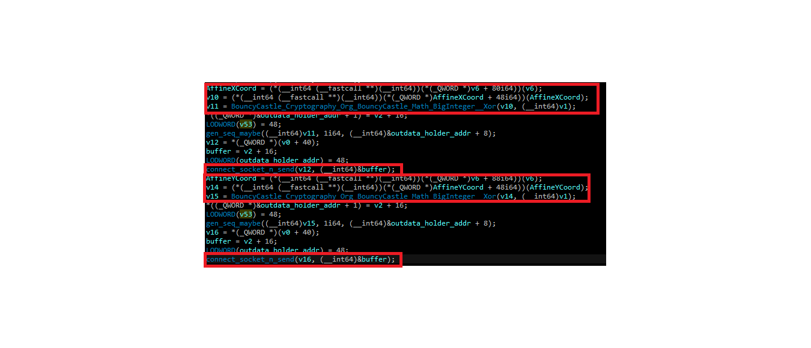 

Next, it receives new X, Y from the server, XOR the received data with `0x133713371337133713371337133713371337133713371337133713371337133713371337133713371337133713371337`, creates a new point from these two values, and then multiplies this new point by N:

  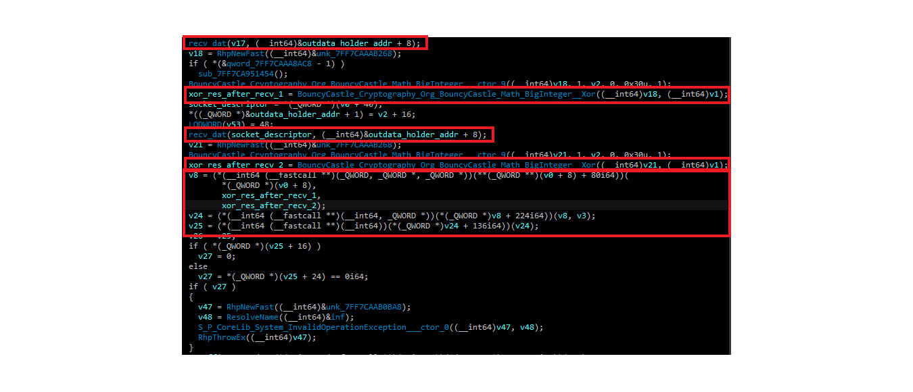 

After that, it takes the new Affine X, does `SHA512` on it:

  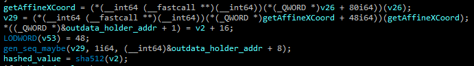 

Then, it calls the ChaCha encryption function, with the key and nonce truncated from the hashed value. Since only 48 bytes are received to get the new X, Y above, encrypted data will be taken starting from after the X, Y that the server sends back:

  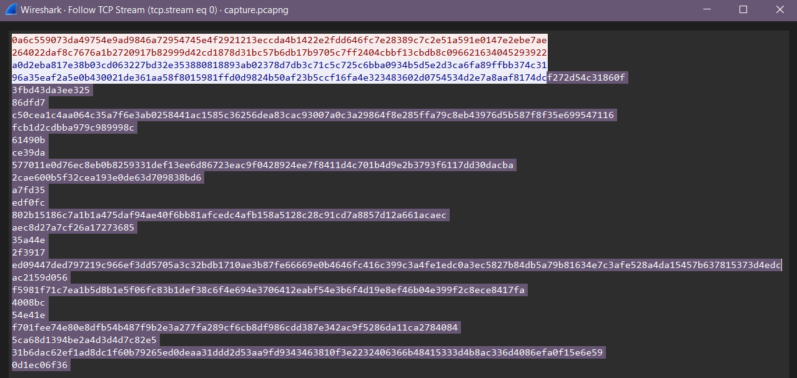 

With all these steps clear, I wrote a script to solve. First, to retrieve the new Affine X value, I used the following script:

```
using System.Text;
using Org.BouncyCastle.Math;
using Org.BouncyCastle.Utilities.Encoders;
using Org.BouncyCastle.Math.EC;

var p = new BigInteger("c90102faa48f18b5eac1f76bb40a1b9fb0d841712bbe3e5576a7a56976c2baeca47809765283aa078583e1e65172a3fd", 16);
var a = new BigInteger("a079db08ea2470350c182487b50f7707dd46a58a1d160ff79297dcc9bfad6cfc96a81c4a97564118a40331fe0fc1327f", 16);
var b = new BigInteger("9f939c02a7bd7fc263a4cce416f4c575f28d0c1315c4f0c282fca6709a5f9f7f9c251c9eede9eb1baa31602167fa5380", 16);
var svX = new BigInteger("a0d2eba817e38b03cd063227bd32e353880818893ab02378d7db3c71c5c725c6bba0934b5d5e2d3ca6fa89ffbb374c31", 16);
var svY = new BigInteger("96a35eaf2a5e0b430021de361aa58f8015981ffd0d9824b50af23b5ccf16fa4e323483602d0754534d2e7a8aaf8174dc", 16);
Byte[] N = Hex.Decode("7ed85751e7131b5eaf5592718bef79a9");
var iN = new BigInteger(N);
var _1337b = UTF8Encoding.UTF8.GetBytes("133713371337133713371337133713371337133713371337133713371337133713371337133713371337133713371337");
var _1337 = new BigInteger(Encoding.UTF8.GetString(_1337b), 16);


Org.BouncyCastle.Math.EC.ECCurve fpcurve = (Org.BouncyCastle.Math.EC.ECCurve)new FpCurve(p, a, b);
svX = svX.Xor(_1337);
svY = svY.Xor(_1337);

var srvPoint = fpcurve.CreatePoint(svX, svY);
var srvMulPoint = srvPoint.Multiply(iN);
var srvNorPoint = srvMulPoint.Normalize();
var new_svX = srvNorPoint.AffineXCoord.ToBigInteger();

Console.WriteLine(Hex.ToHexString(new_svX.ToByteArray()));
```

The output is `3c54f90f4d2cc9c0b62df2866c2b4f0c5afae8136d2a1e76d2694999624325f5609c50b4677efa21a37664b50cec92c0`. Sha512 it, truncate, and then decrypt ChaCha with data from the pcap following the directions above:

  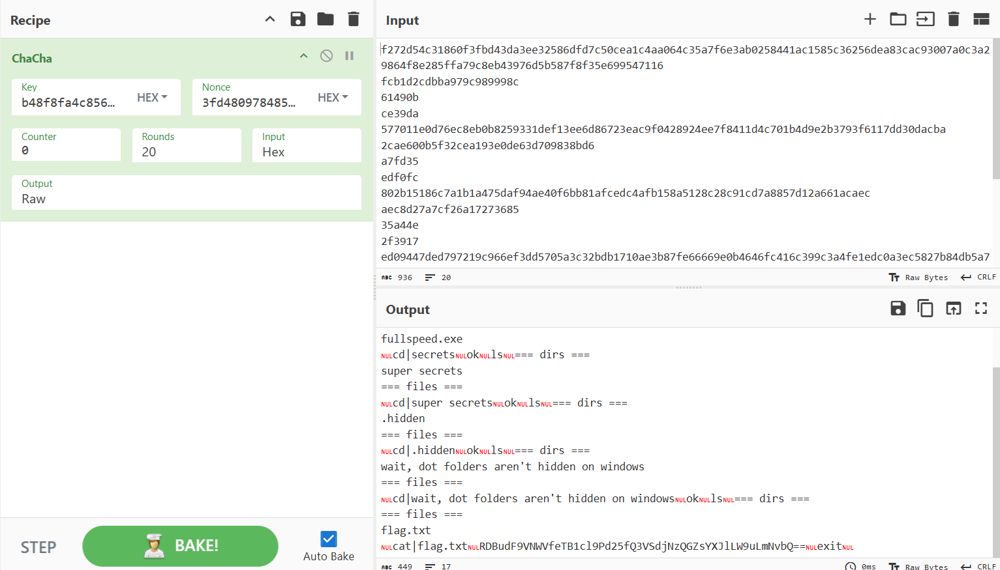 

Base64 decode, and we have the flag: `D0nt_U5e_y0ur_Own_CuRv3s@flare-on.com`

