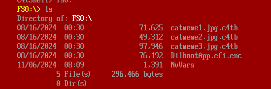
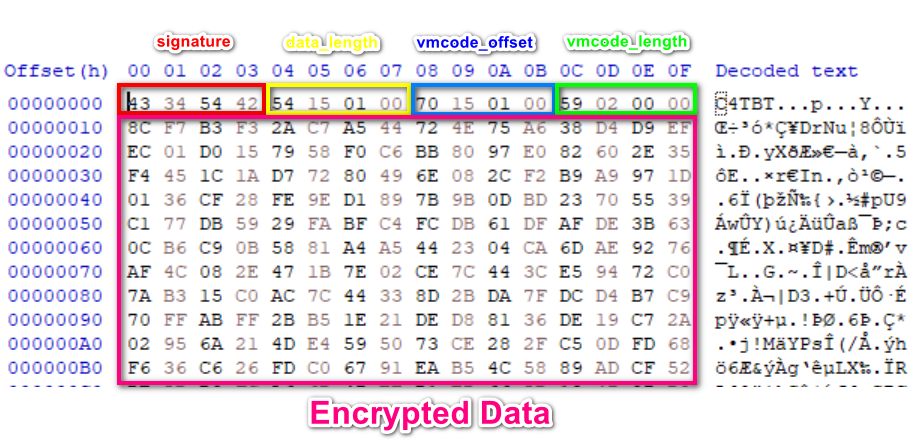
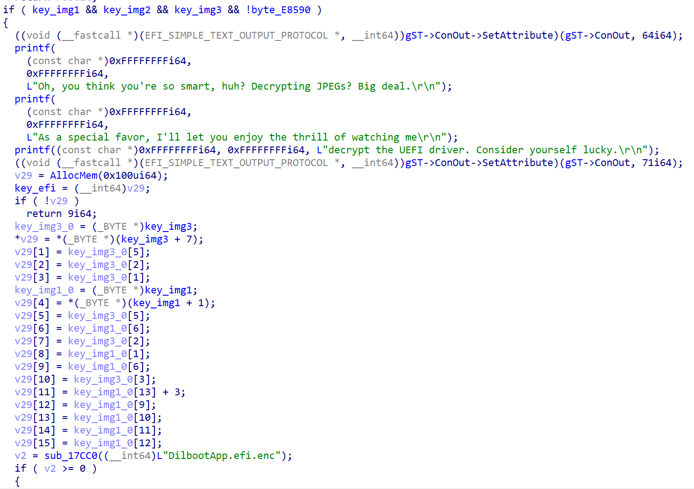

# 10 - Catbert Ransomware


## Initial analysis

The given files include a UEFI boot image and an encrypted disk image. First, i tried booting this with QEMU with command:

`qemu-system-x86_64 -bios bios.bin -drive file=disk.img,format=raw`

The disk contains three encrypted images and an EFI file



After some exploration, I found the command `decrypt_file`, which can be used to decrypt the three .c4tb files shown above


Next, I extracted the `bios.bin` file using [UEFITool](https://github.com/LongSoft/UEFITool) with the `unpack` option, which yielded numerous files. Since I am not very familiar with UEFI and wasn’t sure what to do next , I used a "super" tool — `strings | grep` — to search for the `decrypt_file` string in all the extracted files, hoping to locate the file that processes this command. And boom! Look what we found — a PE file!


## Shell_body.bin

It's a PE file running in UEFI


Let’s load it into IDA with plugin [efiXplorer](https://github.com/binarly-io/efiXplorer). It's easy to find the function `sub_31BC4()` that handles the `decrypt_file` command.


By running the `efiXplorer` plugin, we can easily resolve many library function names


First, it checks if the signature of the encrypted file is `C4TB`


I created two structs and renamed some parameters to make it easier to read

```c
struct c4tb
{
  DWORD signature;
  DWORD enc_length;
  DWORD vmcode_offset;
  DWORD length_vmcode;
  char *enc_data_offset;
};

struct x
{
  DWORD signature;
  DWORD encrypted_data_length;
  DWORD vmcode_offset;
  DWORD len_vmcode;
  __int64 decrypt_buffer;
  __int64 enc_buffer;
};

```
This code snippet reads the `c4tb` file and copies the input to vmcode:


c4tb File Format Structure




It then checks the key we input against `vmcode` in the `CheckKey()` function (we’ll discuss this later). If the key is correct, it will decrypt the image using the RC4 algorithm


After successfully decrypting three images, it will decrypt the EFI using the key that was used to decrypt images 1 and 3:



So, our task now is to find the key to decrypt the three images.

## VMCode Compiler

Now, let’s go back to the CheckKey() function. It’s a compiler for vmcode, consisting of opcodes from `0x00` to `0x26` that perform operations similar to `push`, `pop`, `xor`, `and`, `shl`, and others.


I have reimplemented it in Python ([here](vmCodeCompiler.py)). With an input of aaaaaaaaaaaaaaaa, it will print out as follows:

```asm
push 0x0
push 0x6161
MOV STORE[0x0],0x6161
push 0x1
push 0x6161
MOV STORE[0x1],0x6161
push 0x2
push 0x6161
MOV STORE[0x2],0x6161
push 0x3
push 0x6161
MOV STORE[0x3],0x6161
push 0x4
push 0x6161
MOV STORE[0x4],0x6161
push 0x5
push 0x6161
...
...
...
```
## Image 1

The vmcode for checking the key to decrypt Image 1 performs operations like this

```python
input = [0x44,0x61,0x43,0x75,0x62,0x69,0x63,0x6c,0x65,0x4c,0x69,0x66,0x65,0x31,0x30,0x31]
cipher = [0x44,0x61,0x34,0x75,0x62,0x69,0x63,0x6c,0x65,0x31,0x69,0x66,0x65,0x62,0x30,0x62]
def lose():
    print("wrong")
    exit()
def win():
    print("correct")
    exit()
for i in range(16):
    if i == 2:
        if(input[i]!=0xff&((cipher[i] >> 0x4) | (cipher[i] <<0x4))):
            lose()
        continue
    if i == 9:
        if(input[i]!=0xff&((cipher[i] << 0x6) | (cipher[i] >> 0x2))):
            lose()
        continue
    if i == 13 or i == 15:
        if(input[i]!=0xff&((cipher[i] >> 0x1) | (cipher[i] << 0x7))):
            lose()
        continue
    if (input[i] != cipher[i]):
        lose()
win()

```

The first key is easy to find: `DaCubicleLife101`


We’ve obtained the first part of the flag


## Image 2

Key 2 verification algorithm

```python
input = [0x47, 0x33, 0x74, 0x44, 0x61, 0x4a, 0x30, 0x62, 0x44, 0x30, 0x6e, 0x65, 0x4d, 0x34, 0x74, 0x65]
value = [0x1e, 0x93, 0x39, 0x2e, 0x42, 0x94, 0xf0, 0x46, 0xa6, 0x54, 0xdf, 0x3c, 0x4a, 0x46, 0x28, 0x1a]
cipher = [0x59, 0xa0, 0x4d, 0x6a, 0x23, 0xde, 0xc0, 0x24, 0xe2, 0x64, 0xb1, 0x59, 0x07, 0x72, 0x5c, 0x7f]

def lose():
    print("wrong")
    exit()
def win():
    print("correct")
    exit()

for i in range(len(input)):
    if(input[i]^value[i]!=cipher[i]):
        lose()
win()
```

Decrypt image 2 with Key `G3tDaJ0bD0neM4te` 


## Image 3

The first 4 characters of the key are checked using the DJB2 hash algorithm:

```python
def djb2_hash(string):
    hash_value = 0x1505
    for char in string:
        hash_value = (hash_value *33) + ord(char)
    return (hash_value & 0xFFFFFFFF) == 0x7c8df4cb

```

I used brute force and got many plausible results, but only `VerY` seemed meaningful. 

The next 4 characters are simply a rotation by 13 (ror 13) added to the input:

```python
def ror13AddHash32(string):
    val = 0
    for i in string:
        val = ror(val, 0xd, 32)
        val += i
    return (val & 0xffffffff) == 0x8b681d82
```

Easy to find that an input that satisfies the condition is DumB

The last 8 characters are checked using Adler-32

```python
def adler32(input_vals):
    MOD_ADLER = 0xFFF1
    s1 = 1
    s2 = 0

    for byte in input_vals:
        s1 = (s1 + byte) % MOD_ADLER
        s2 = (s2 + s1) % MOD_ADLER

    return (s2 << 16) | s1 == 0xf910374
```

I found the plaintext of the hash on [google](https://md5hashing.net/hash/adler32/0f910374) is `password`. Now we have the full password to decrypt image 3 : `VeryDumBpassword` Let's decrypt


After decrypting the three images, it automatically decrypts the Dilboot.efi file. Try running it


Lets decrypt final image: 


Flag: th3_ro4d_t0_succ3ss_1s_alw4ys_und3r_c0nstructi0n@flare-on.com


