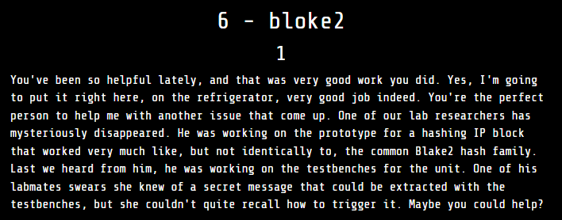

We were provided with some Verilog files, specifically test benches and modules for the implementation of BLAKE2 hash calculations.

After compiling the test bench files and examining their output, I am now mainly focusing on two files:

- `bloke2s.v`

- `bloke2b.v`

The test benches for these modules hash some test messages:

  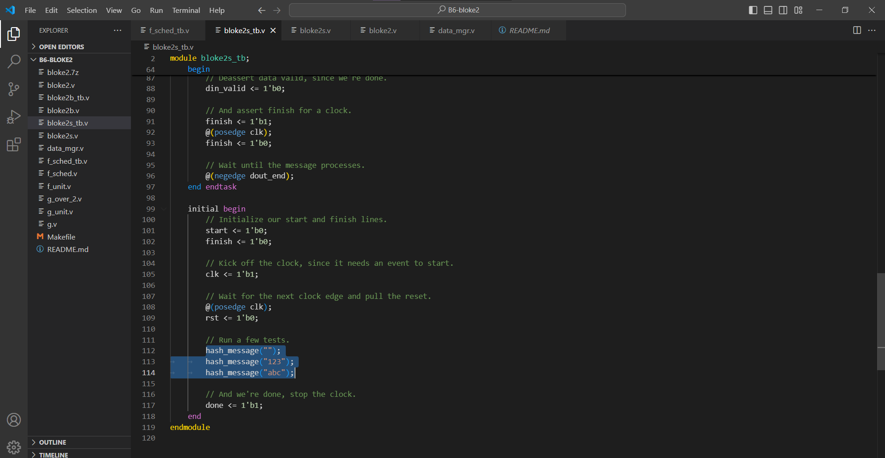
    
Output is the hash result, with different lengths for each type: Blake2b optimized for 64-bit platforms and produces digests of any size between 1 and 64 bytes, while Blake2s optimized for 8- to 32-bit platforms and produces digests of any size between 1 and 32 bytes:

-   BLOKE2S:
 
  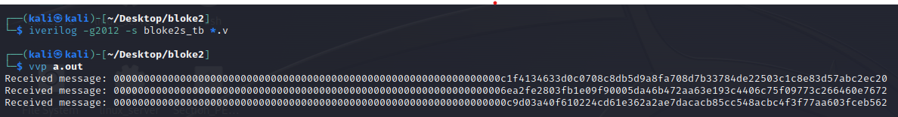

- BLOKE2B:
 
  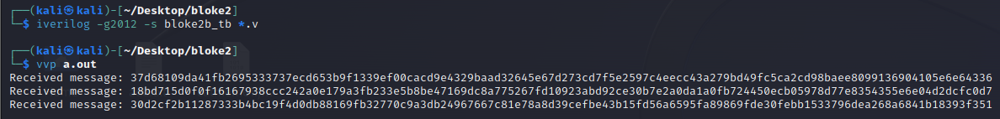

Based on the description, our goal is a message that can be extracted from the test bench. To do this, i decided to trace back from the first file that prints out the hashes. Ignoring the test bench for the `bloke2s` module, we went directly into `bloke2s.v`. Initially, this one invokes `bloke2` module, pass parameters into it, indicating that `bloke2s.v` serves as a wrapper of actual hashing module:

  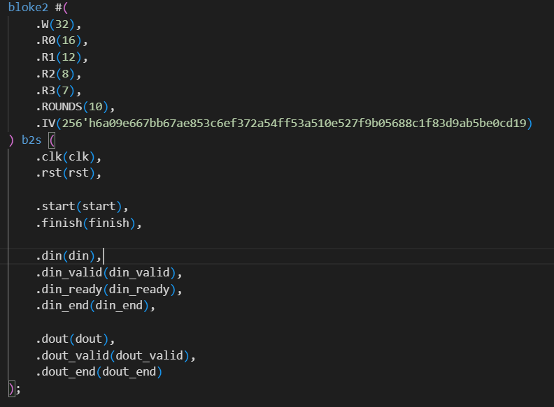

Moving on to `bloke2.v`, it invokes the `f_unit` and `data_mgr` modules:

  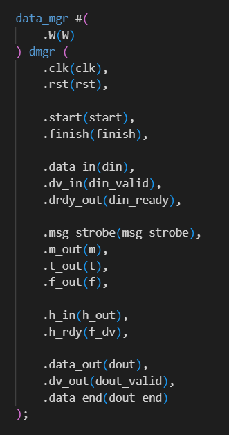

  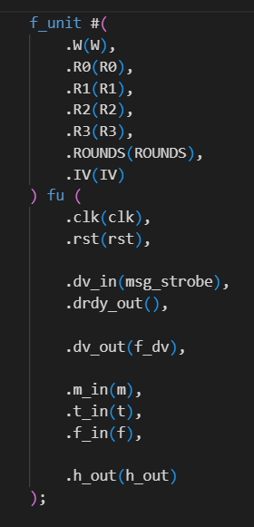

`f_unit` module then invokes all the remaining modules, setting up some BLAKE2 constants for the subsequent hashing process, as shown below:

  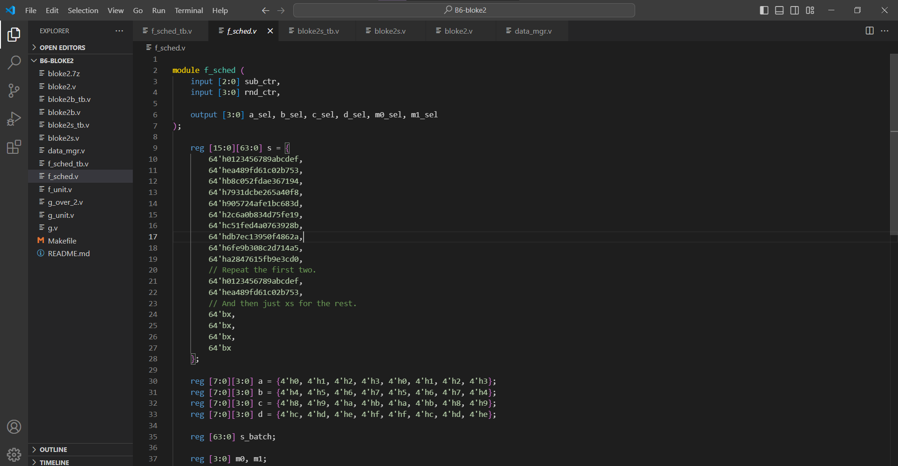

Therefore, it’s better to ignore this part and not delve too deeply into the hashing process, as our target is the hidden message.

When examining `data_mgr.v`, we can observe a suspicious value there:

  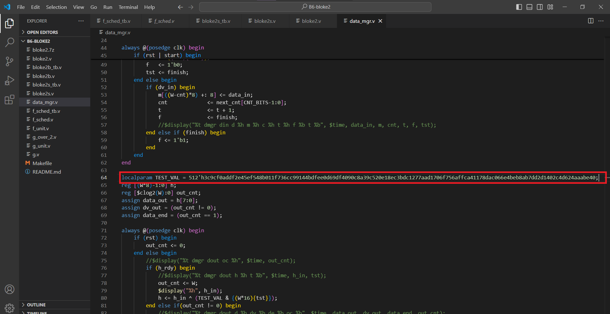

To confirm my assumption this is our hidden message, i changed `TEST_VAL` to different value, then ran `bloke2s_tb.v` again. Since it didnt affects the hashing result, i proceeded to analyze further how this variable is used in the code.

It is going to be used to XOR with `h_in`:

  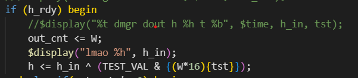

`h_in` here refers to `h_out`:

  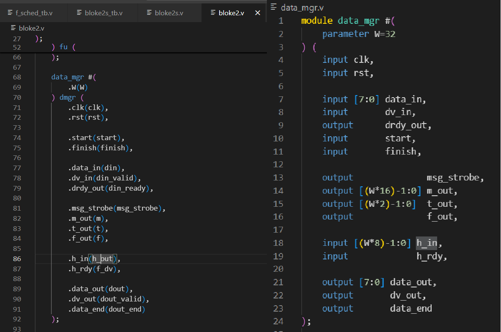

Compare to an [implement of blake2](https://github.com/buggywhip/blake2_py/blob/master/blake2.py). `h_out` should be hash result:

  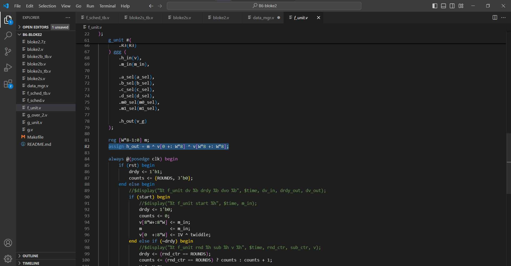

We can confirm that by printing out the `h_in`, you will see `h_in` is our hash value but in reverse order:

  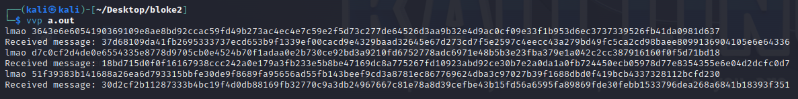

Next, we can simply xor reversed hash with `TEST_LOCAL`, where one of them is flag:

  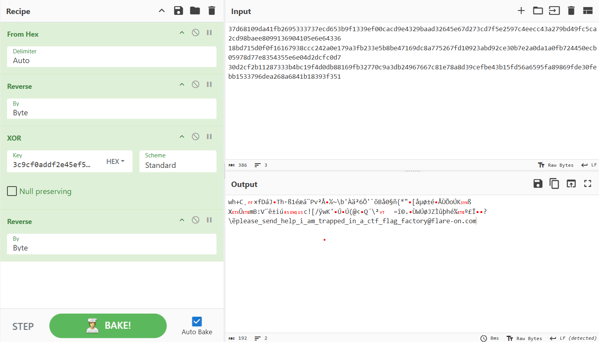

Flag: `please_send_help_i_am_trapped_in_a_ctf_flag_factory@flare-on.com`
